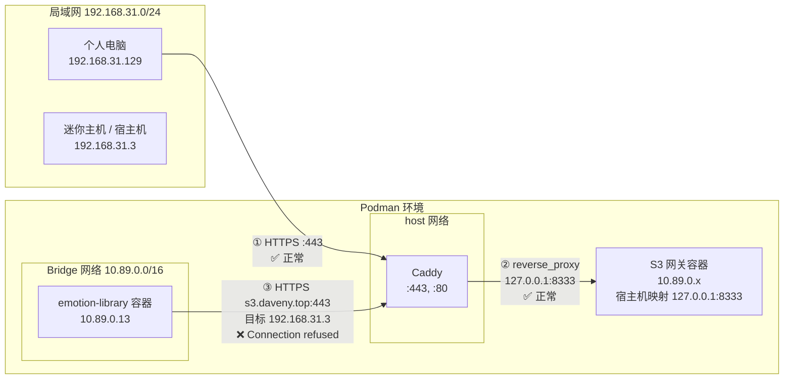
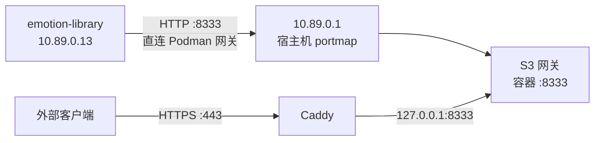

# Podman 桥接网络的 hairpin NAT 问题

## 1. 场景

**路由器**：主要负责内网设备间通讯，为设备分配网段 192.168.0.0/24 的 IP 地址，用于局域网内设备互联。同时提供域名解析，将 *.daveny.top 解析到 192.168.31.3。

**迷你主机**：固定 IP 为 192.168.31.3，部署服务：

1. Caddy 反向代理。
    * 部署方式：Podman
    * 网络模式：host
    * 端口监听：443 与 80
2. S3 服务。
    * 使用 Podman 部署
    * 端口绑定 127.0.0.1:8333
    * 默认网络（Bridge）模式。
3. 个人应用 emotion-library，使用了本地部署的 S3 服务。
    * 使用 Podman 部署
    * 端口绑定 127.0.0.1:8000
    * 默认网络（Bridge）模式。

**个人电脑**：IP 为 192.168.31.129，试在浏览器中通过 library.daveny.top 使用 emotion-library。

## 2. 问题描述

**现象 1**：在个人电脑的浏览器中打开 library.daveny.top 时，页面无法正常返回应从 S3 服务中获取的资源。HTTP 错误码为 502。

**现象 2**：在 emotion-library 的容器内执行 `curl -v https://s3.daveny.top`，返回如下报错：

```text
  % Total    % Received % Xferd  Average Speed   Time    Time     Time  Current
                                 Dload  Upload   Total   Spent    Left  Speed
  0     0    0     0    0     0      0      0 --:--:-- --:--:-- --:--:--     0* Host s3.daveny.top:443 was resolved.
* IPv6: (none)
* IPv4: 192.168.31.3
*   Trying 192.168.31.3:443...
* connect to 192.168.31.3 port 443 from 10.89.0.13 port 47548 failed: Connection refused
* Failed to connect to s3.daveny.top port 443 after 1 ms: Could not connect to server
  0     0    0     0    0     0      0      0 --:--:-- --:--:-- --:--:--     0
* closing connection #0
curl: (7) Failed to connect to s3.daveny.top port 443 after 1 ms: Could not connect to server
```

关键信息：

* DNS 解析成功：`s3.daveny.top` → `192.168.31.3` ✅
* 连接被拒：`Connection refused`（不是超时、不是 TLS 错误），说明 TCP SYN 到达了宿主机但 **443 端口在流量来源路径上不可达**

> `Connection refused` 发生在 TCP 握手阶段，早于 TLS 握手。所以这个错误与证书、TLS 配置无关——是纯网络层（L4）的问题。

**现象 3**：使用个人电脑（外部设备，IP 192.168.31.129）部署 emotion-library 时，页面行为符合预期，可以正常显示应从 S3 服务中获取的资源。

**现象 4**：在宿主机（迷你主机）上执行 `curl -v https://s3.daveny.top` 正常返回。

## 3. 问题分析

这是一个 Podman 桥接网络的 hairpin NAT 问题。

### 3.1. 1 网络拓扑



### 3.2. 2 流量路径对比

**外部访问（正常）**：

```
PC (192.168.31.129)
  → 路由器 DNS: s3.daveny.top = 192.168.31.3
  → TCP SYN → 192.168.31.3:443
  → 宿主机 iptables INPUT 链 → ACCEPT（hostNetwork 模式的 Caddy 直接监听）
  → Caddy 处理 TLS
  → reverse_proxy → 127.0.0.1:8333 → S3 网关
  ✅ 正常
```

**Bridge 容器内部访问（失败）**：

```
emotion-library (10.89.0.13)
  → 内置 DNS: s3.daveny.top = 192.168.31.3
  → TCP SYN → 192.168.31.3:443
  → 包从 bridge 接口（podman0）进入宿主机网络栈
  → iptables 的 CNI 规则链处理
  → 源 IP 10.89.0.13，目标 192.168.31.3:443
  → ❌ 回包路径异常：宿主机不知道如何将应答包送回 bridge 内的 10.89.0.13
  → Connection refused
```

### 3.3. 3 根因

Caddy 用了 `hostNetwork: true`，直接监听宿主机 `192.168.31.3:443`。但从 Podman bridge 网络内的容器发出、目标是宿主机外部 IP 的流量，Podman 的容器网络接口（CNI）默认不会正确做 hairpin NAT——TCP SYN 到达了宿主机的网络栈，但**回包没有正确 SNAT/DNAT 回到 bridge 内的源容器**，表现为 `Connection refused`。

> **Hairpin NAT**（又称 NAT loopback / NAT reflection）：当内网设备使用公网地址访问内网服务时，路由器/网关将流量直接在本地转发给目标服务器，并正确处理双向地址转换。

Podman 默认的 bridge CNI 插件（`bridge` + `portmap` + `firewall`）没有内置 hairpin NAT 支持。相比之下，Docker 的 `docker0` 桥接在某些配置下会自动处理，但这也不是可移植的行为。

## 4. 解决方案

### 4.1. 方案 1：内部直连

S3 服务端口对宿主机 bridge 网段开放，emotion-library 通过 Podman 内部地址直连，绕过 Caddy。

**步骤**：

1. **k8s.seaweedfs.yaml** — S3 端口不做 IP 限制：

    ```yaml
    - name: s3
      ports:
          - containerPort: 8333
            hostPort: 8333
            # 不设 hostIP，默认映射到 0.0.0.0
    ```

2. **k8s.emotion-library.yaml** — S3 端点改为 Podman 内部地址：

    ```yaml
    data:
        S3_ENDPOINT_URL: "http://host.containers.internal:8333"
    ```

    或使用网关 IP（更确定但需要确认网段）：

    ```yaml
        S3_ENDPOINT_URL: "http://10.89.0.1:8333"
    ```

**作用机理**：



emotion-library 访问 S3 直接在 Podman 内部网络完成，不经 Caddy、不经 TLS、不触发 hairpin NAT。外部访问仍走 Caddy → `127.0.0.1:8333`，不受影响。

**优点**：

* emotion-library 保持 bridge 模式，安全隔离不变
* 不依赖 Caddy、不消耗 TLS 计算
* S3 端口虽然监听 `0.0.0.0`，但仅在宿主机网络栈内可见（除非显式做 DNAT）
* 同宿主机上其他 bridge 容器都可复用此模式

**缺点**：

* `host.containers.internal` 是 Podman 特性，Docker 中叫 `host.docker.internal`
* 网关 IP `10.89.0.1` 可能随 Podman 网络重建变化（但默认 `podman` 网络不删则不变）

### 4.2. 方案 2：emotion-library 改用 host 网络

```yaml
spec:
    hostNetwork: true
```

**优点**：

* 最彻底的解决方案，不存在任何 hairpin NAT 问题
* 避免定义 S3 端点时与 S3 端口耦合
* 性能最优，无 NAT 开销

**缺点**：

* 失去网络隔离，容器可直接访问宿主机所有端口
* 端口管理死板——uvicorn 的 `8000` 直接占用宿主机端口，需要额外用环境变量控制
* 容器数量增加时端口冲突风险高

### 4.3. 方案 3：iptables hairpin NAT 规则（不推荐）

在宿主机上加一条 DNAT + SNAT 规则，手动实现 hairpin：

```bash
# 对来自 bridge 网段、目标为宿主机 443 的流量做源地址转换
iptables -t nat -I POSTROUTING -s 10.89.0.0/16 -d 192.168.31.3 \
    -p tcp --dport 443 -j MASQUERADE
```

**不推荐原因**：规则与 CNI 耦合，Podman 重启或网络重建后可能失效；排障时又多了一层 NAT。

## 5. 诊断方法

当怀疑 hairpin NAT 问题时，按以下步骤排查：

```bash
# 1. 确认 DNS 解析（容器内）
podman exec <container> nslookup s3.daveny.top

# 2. 确认端口可达性（容器内）
podman exec <container> curl -v https://s3.daveny.top

# 3. 对比宿主机是否能通
curl -v https://s3.daveny.top

# 4. 检查容器网络模式
podman inspect <container> --format '{{.HostConfig.NetworkMode}}'

# 5. 检查 bridge 网关 IP
podman network inspect podman | jq '.[0].subnets'

# 6. 查看 iptables NAT 规则
iptables -t nat -L -n -v | grep -E '443|8333'
```

关键判断：**宿主机通 + 容器不通 = hairpin NAT**（几乎一定是，已排除 DNS 和端口的问题）。

## 6. 附录

### 6.1. Bridge 网络引入的复杂度

Bridge 网络给应用部署带来了以下额外复杂度：

| 维度            | 问题                                                                      | 本次体现                                      |
| --------------- | ------------------------------------------------------------------------- | --------------------------------------------- |
| **Hairpin NAT** | 容器通过宿主机外部 IP 访问宿主机端口时回程路径断裂                        | `curl s3.daveny.top:443` → Connection refused |
| **身份二义性**  | `localhost` / `127.0.0.1` 在容器内指向容器自身，不是宿主机                | S3 绑 `127.0.0.1:8333`，容器看不到            |
| **特殊 DNS 名** | 需要 `host.containers.internal` 等非标 DNS 名来访问宿主机，且值随环境变化 | -                                             |
| **性能开销**    | 每个包过 iptables NAT 表，吞吐量下降                                      | S3 大文件传输有额外损耗                       |
| **排障门槛**    | 问题要在 iptables/nftables 规则链里追包                                   | -                                             |

本质矛盾：应用层不关心网络拓扑，但 bridge 把拓扑差异暴露给了应用层（「我在容器里，宿主机是谁？怎么找到 S3？」）。host 模式把这个复杂度推给编排层，bridge 模式则交给了应用层自己承担。
