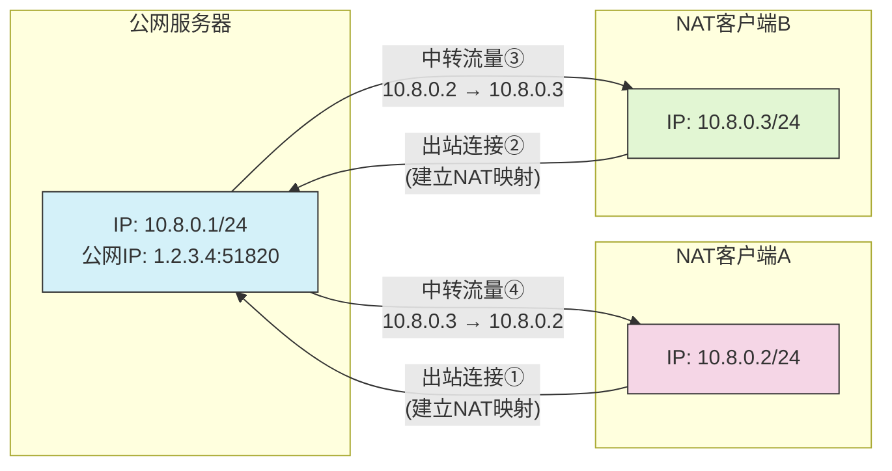
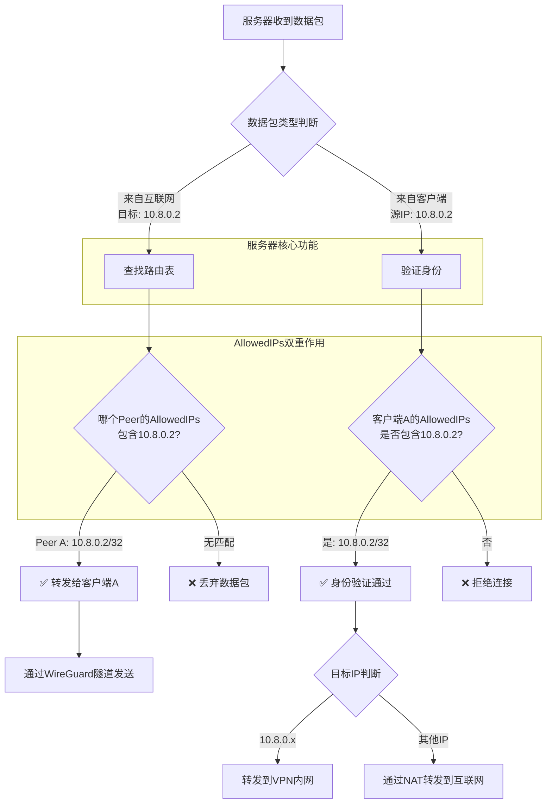
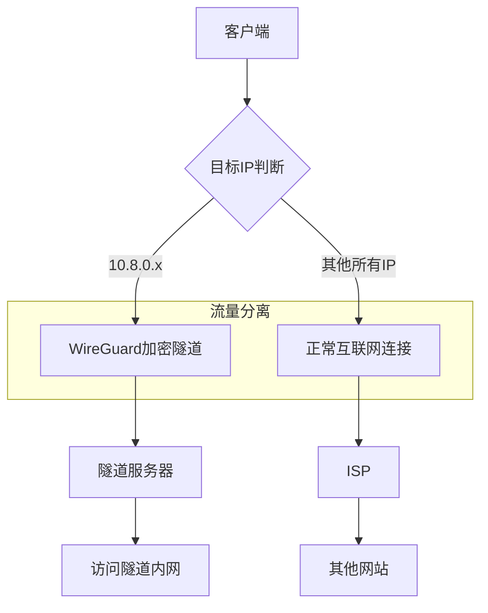

# WireGuard 中的相关概念

## 1. 网络拓扑

通过 WireGuard 实现客户端 A 和客户端 B 的通讯

| 终端     | 内网 IP     | Endpoint      |
| -------- | ----------- | ------------- |
| 服务器端 | 10.8.0.1/24 | 1.2.3.4:51820 |
| 客户端 A | 10.8.0.2/24 |
| 客户端 B | 10.8.0.3/24 |



## 2. 配置项

### 2.1. 概览

服务器端

```ini
[Interface]
# 服务器在虚拟网络中的 IP 地址
Address = 10.8.0.1/24
# WireGuard 监听的UDP端口，需在防火墙放行
ListenPort = 51820
# 服务器私钥，填入wg genkey生成的密钥
PrivateKey = [SERVER/key]

# 启动 WireGuard 时执行的命令
PostUp = iptables -A FORWARD -i %i -j ACCEPT;
PostUp = iptables -A FORWARD -o %i -j ACCEPT;
PostUp = iptables -t nat -A POSTROUTING -o eth0 -j MASQUERADE

# 停止 WIreGuard 时执行的命令
PostDown = iptables -D FORWARD -i %i -j ACCEPT;
PostDown = iptables -D FORWARD -o %i -j ACCEPT;
PostDown = iptables -t nat -D POSTROUTING -o eth0 -j MASQUERADE

# 定义允许接入虚拟网络的客户端，每个Peer表示一个客户端
[Peer]
# 客户端 A 公钥
PublicKey = [CLIENT_A/pubkey]
# 允许该客户端使用的 IP 地址，通常用/32以完全限定 IP
AllowedIPs = 10.8.0.2/32

[Peer]
# 客户端 B 公钥
PublicKey = [CLIENT_B/pubkey]
# 允许该客户端使用的 IP 地址，通常用/32以完全限定 IP
AllowedIPs = 10.8.0.3/32
```

客户端

```ini
[Interface]
# 客户端私钥，填入client_private.key的内容
PrivateKey = [CLIENT/key]
# 虚拟局域网地址
Address = 10.8.0.2/24

[Peer]
# 服务器端公钥
PublicKey = [SERVER/pubkey]
# 路由规则，允许的IP范围，这一值决定哪些流量会通过WireGuard服务器
AllowedIPs = 10.8.0.0/24
# 服务器端公网地址:端口，需要放行指定端口的 UDP 协议
Endpoint = [SERVER/ip:port]
# 保活消息发送间隔，单位为秒
PersistentKeepalive = 25
```

### 2.2. AllowedIPs

| 配置位置     | `AllowedIPs` 值 | 含义                       | 作用                                                                           |
| ------------ | --------------- | -------------------------- | ------------------------------------------------------------------------------ |
| **服务器端** | `10.8.0.2/32`   | 允许客户端使用的源 IP      | 1. 身份验证（哪个 IP 对应哪个公钥）<br>2. 路由决策（发往 10.8.0.2 的流量给谁） |
| **客户端端** | `10.8.0.0/24`   | 客户端要加密的目标 IP 范围 | 1. 决定哪些流量走 VPN<br>2. 路由分流                                           |

**例：**

服务器端

```ini
[Interface]
Address = 10.8.0.1/24
ListenPort = 51820
PrivateKey = [SERVER/key]

[Peer]
PublicKey = [CLIENT/pubkey]
AllowedIPs = 10.8.0.2/32  # 仅允许客户端用10.8.0.2
```



客户端

```ini
[Interface]
Address = 10.8.0.2/24
PrivateKey = [CLIENT/key]

[Peer]
PublicKey = [SERVER/pubkey]
Endpoint = [SERVER/ip:port]
AllowedIPs = 10.8.0.0/24  # 访问 VPN 内网都走隧道
```


