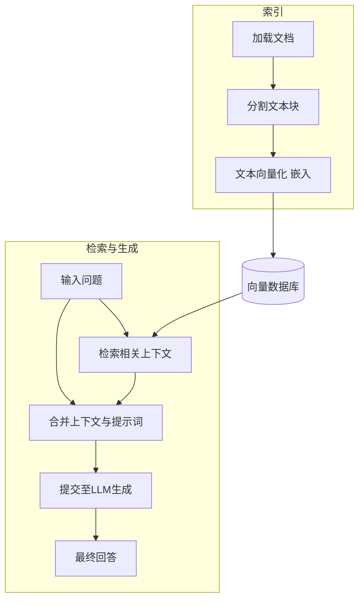
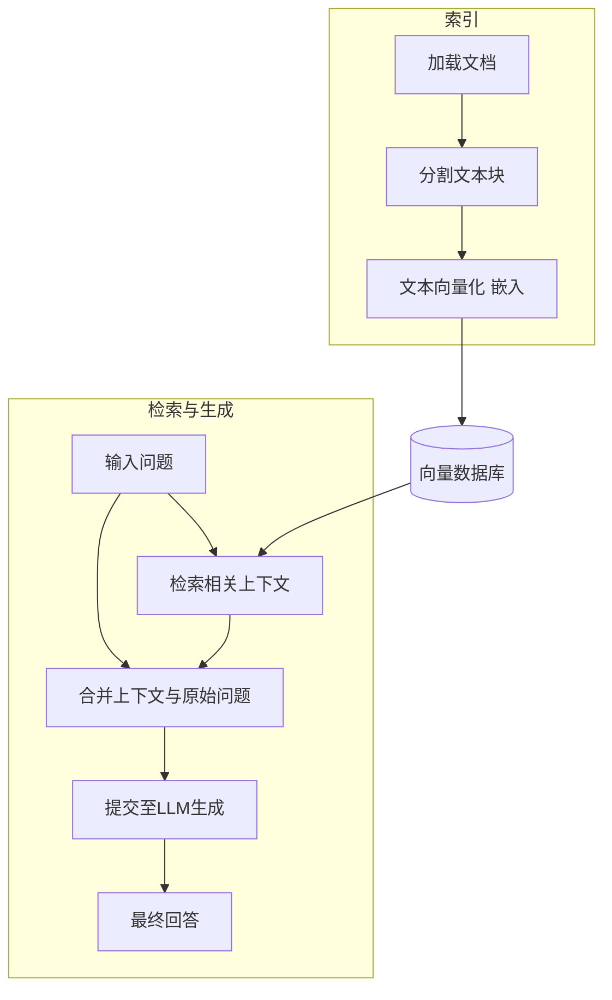
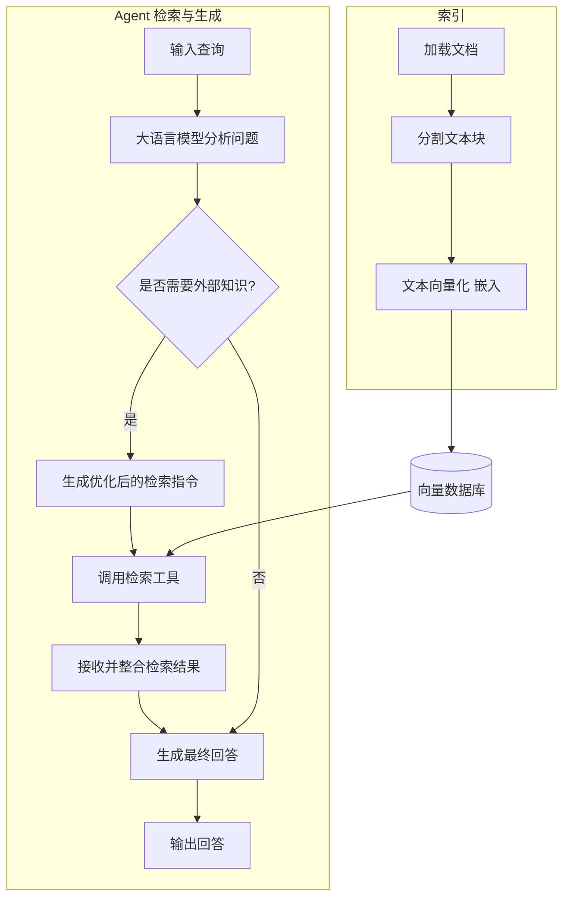

[TOC]

## 1 概述

RAG（Retrieval-Augmented Generation，检索增强生成） 让大语言模型能够实时获取和引用外部知识来增强生成，从而改进回答的准确性和时效性。

## 2 工作流

### 2.1 概览

### 2.2 索引

用于将数据存储到向量存储库，以用于后续检索。索引阶段大致包含以下步骤

1. 加载
   : 用于加载文本
2. 分割
   : 将文本分割为特定大小的块
3. 嵌入
   : 使用模型将文本转化为数学向量表示，用于后续进行相关性检索
4. 存储
   : 将转化为数学向量的文本存储到向量数据库

### 2.3 检索增强

从向量数据库中匹配特定输入语，通过余弦相似度等相似度匹配算法找出与输入语相关的资料片段，将其作为 Prompt 的上下文合并到原提示词中，以提高 LLM 生成的回答的准确性。检索增强阶段大致包含以下步骤

1. 检索
   : 将原问题（或者转化后的问题）作为查询语，通过余弦相似度等算法从数据库中查找存在相关性的文本片段
2. 增强
   : 将检索阶段得到的文本片段作为上下文合并到原 Prompt
3. 提交并生成
   : 将合并增强后的 Prompt 提交给 LLM 生成回答

## 3 相关知识

### 3.1 嵌入模型

嵌入模型（Embeddings）是一种将文本转化为机器可计算的语义表示，其将文本映射为一个特定长度的向量，该向量表示了文本的语义信息。基于语义相似的文本在向量空间的距离也更接近这一前提，在将文本转化为语义向量后，计算机便可以通过计算向量之间的空间距离来判断两段文本的相似度，而不需要依赖精确的关键词匹配。

嵌入模型是实现语义检索的关键，其模型质量决定了检索的准确性（相关性）。

### 3.2 加载器

加载器（Loader）用于从多种来源获取原始数据，将其标准化为可被嵌入模型处理的格式。例如从 PDF、Docx、HTML、Markdown 以及数据库等来源提取并标准化原始数据。

加载器决定了 RAG 知识库可以覆盖的范围。

### 3.3 文本切分器

文本切分器（TextSplitter）用于对文本内容进行切分，通过将长文本切分为特定大小的“块”以用于嵌入与检索。

文本切分器同时会采用重叠滑动窗口等策略来保持块之间的语义连贯性。

> 重叠滑动窗口：让相邻的文本块之间有一部分重叠，以此来避免单个块的信息的不完整。

**作用**

1. 确保单次文本长度在嵌入模型的能力范围内
2. 提高检索效率
3. 降低对 LLM 的上下文长度占用

### 3.4 向量存储库

向量存储库（VectorStore）用于存储经过嵌入模型处理后的高维向量，通过建立索引（HNSW）来实现基于相似度的近似最近邻检索，如以此实现知识库的长期存储与高效检索。

> 近似最近邻检索：一种不以找到“绝对最相似”为目标，只追求找到“非常相似”的结果的检索策略，平衡了精度和速度。

### 3.5 聊天模型

聊天模型（ChatModel）是基于 LLM 构建的语言模型，负责理解由自然语言描述的问题并生成自然语言回答。

模型的能力直接决定了回答的流畅性、逻辑性与准确性。

### 3.6 提示词模板

提示词模板（ChatTemplate）用于定义最终合并发送到 LLM 的问题的文本模板。将用户问题、检索到的上下文与系统指令等元素组装成一个完整的问题文本。

## 4 实现途径

RAG 主要有两种实现途径：预检索合并与 Agent 工具检索。通常，对于简单事实查询任务更适合用预检索合并方案，但对于复杂的分析性任务 Agent 工具检索可能有更好的表现。

### 4.1 预检索合并

经典的两段式检索，流程完全由应用层控制。系统直接使用原始查询检索相关片段，将检索结果简单合并到原始问题后提交给 LLM 生成回答

-   优势
    -   流程简单，易于实现
    -   步骤分离，易于优化
    -   可预测性强
    -   确保一定经过一次检索
-   劣势
    -   检索到的所有文档都将作为上下文发送给 LLM，可能包含无关信息干扰模型判断
    -   无法利用 LLM 对问题的抽象，检索精准度可能受影响

### 4.2 Agent 工具检索

更灵活的范式，将检索的决策权交给 LLM 自身。直接将提示词提交给 LLM，由 LLM 调用工具进行主动检索

-   优势
    -   可以利用 LLM 对问题的抽象，提高检索精准度
    -   模型可根据自身需求进行多轮检索
-   劣势
    -   不易预测结果
    -   无法确保 LLM 一定会调用工具进行检索
