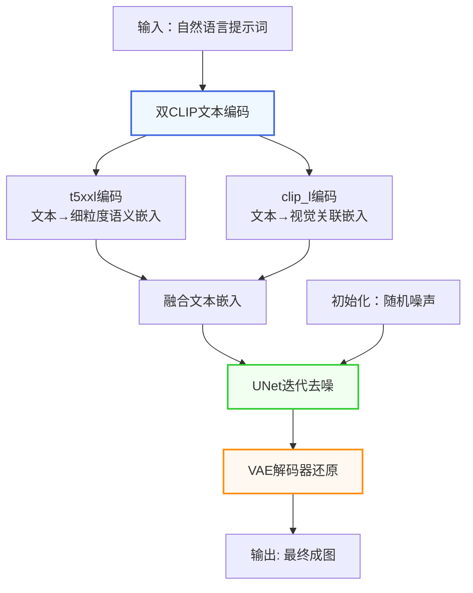
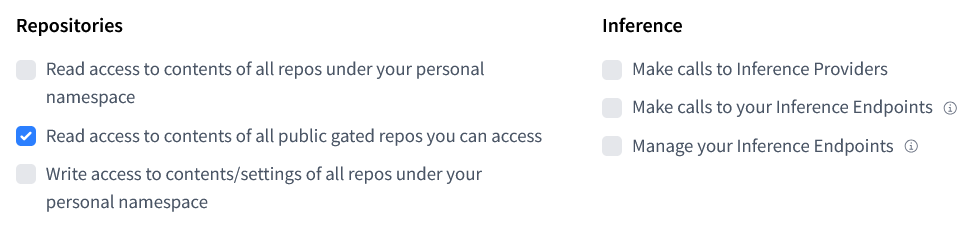
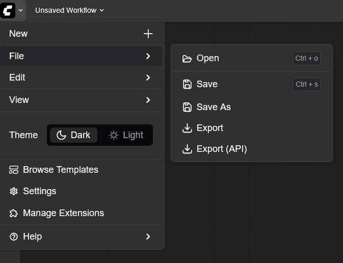
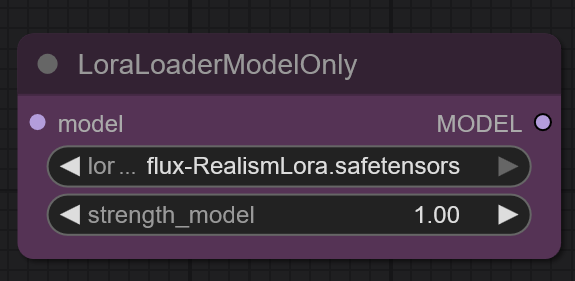
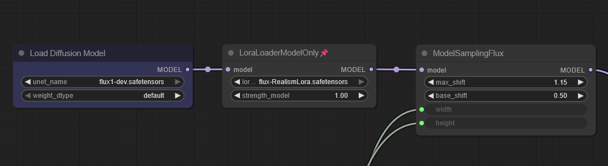
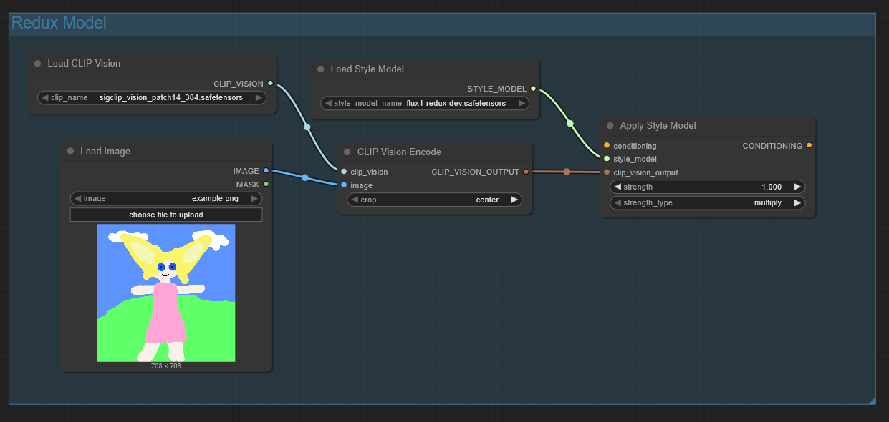
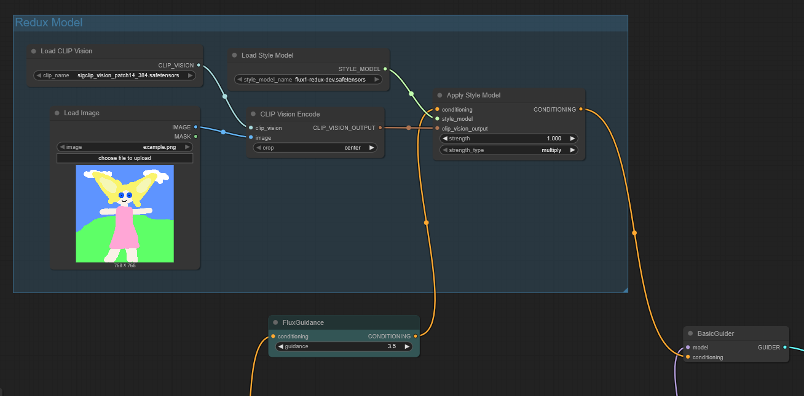
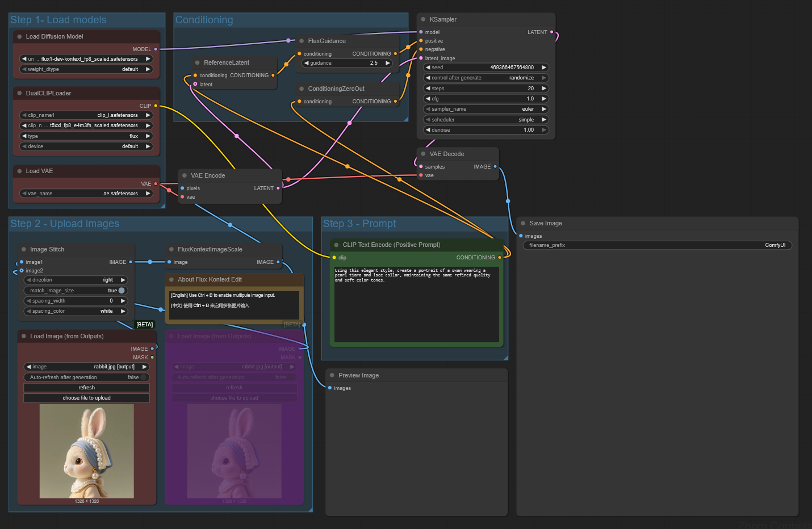
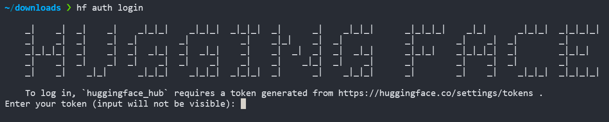

# FLUX 本地部署指南

[TOC]

## 1.前言

### 1.1.FLUX 简介

FLUX 是由原 Stable Diffusion 团队成员离开 Stability AI 后所创建的黑森林实验室（Black Forest Labs）所打造的全新图像生成模型。

### 1.2.技术与法律信息

FLUX 目前主要有三种版本，分别为 FLUX Pro，FLUX Dev 与 FLUX Schnell，三个版本的主要差异如下

| 版本         | 生成质量 | 生成速度 | 开源协议                            | 是否可本地部署 | 是否允许商用 | 适用范围           |
| ------------ | -------- | -------- | ----------------------------------- | -------------- | ------------ | ------------------ |
| FLUX Pro     | 理论最优 | /        | 闭源                                | 否             | 是           | 商业使用           |
| FLUX Dev     | 优       | 较快     | FLUX.1 [dev] Non-Commercial License | 是             | 否           | 研究与开发         |
| FLUX Schnell | 较优     | 最快     | Apache 2.0                          | 是             | 是           | 个人项目与本地使用 |

**(1) FLUX Pro**
FLUX 的完全体，闭源

-   ✅️ 最好的质量
-   ❌ 闭源，仅能够通过 API 调用使用，无法本地部署

**(2) FLUX Dev**
通过对 FLUX Pro 蒸馏而来的适用于研究与开发的非商用开源版本，与 Pro 相比，在能生成高质量的图像的同时降低了部署的硬件需求其并提高了出图速度。

-   ✅️ 可生成质量优秀的图像
-   ✅️ 可本地部署
-   ✅️ 开源
-   ✅️ 社区活跃
-   ❌ 使用的专有开源协议禁止将其商用

需要注意的是 FLUX Dev 还提供了若干适用于特定任务的工具套件及变体，如下表所示

| 名称               | 目标                                                             |
| ------------------ | ---------------------------------------------------------------- |
| FLUX Krea [dev]    | 真实照片风格图像生成                                             |
| FLUX Fill [dev]    | 图像的修复与扩展                                                 |
| FLUX Kontext [dev] | 图像修改                                                         |
| FLUX Redux [dev]   | 基于原图生成图像变体                                             |
| FLUX Canny [dev]   | 以结构指导图像编辑，在保持核心图像结构的情况下生成图像           |
| FLUX Depth [dev]   | 以深度图指导图像编辑，在保持 3D 结构和空间准确性的情况下生成图像 |

**(3) FLUX Schnell**

-   ✅️ 使用 Apache 2.0 开源协议，可商用
-   ✅️ 速度最快，部署的配置需求最低
-   ❌ 生成质量与其他二者比起来稍次

此外，FLUX Dev 与 FLUX Schnell 也有第三方的量化版本（如 FP8 量化），这些量化版本允许用户将 FLUX 部署在一些硬件条件相对稍差的环境中。

### 1.3.FLUX 文本到图像生成的工作流



### 1.4.与其他模型的对比

下图给出了 FLUX 与其他图像生成模型的对比，数据来自黑森林实验室官网


## 2.部署前的准备

由于 FLUX Pro 版闭源且仅能通过 API 调用，故本指南将以部署 FLUX Dev 为例。请注意由于 FLUX Dev 禁止商用，若有商业使用需求需联系 flux@blackforestlabs.ai，或可按相似的步骤部署 FLUX Schnell。

### 2.1.配置需求

| 硬件类型 | 建议                                    | 说明                              |
| -------- | --------------------------------------- | --------------------------------- |
| 操作系统 | Windows 10 或 Ubuntu 24.04（可选 WSL2） | 推荐在 Linux（或 WSL2）上执行部署 |
| 架构     | x86_64                                  |                                   |
| GPU      | 22GB 及以上的 VRAM 且具有 CUDA 核心     |                                   |
| RAM      | 32GB 及以上 RAM                         | 若 GPU 显存较小，则需要更大的 RAM |
| 硬盘     | SSD 100GB 及以上的可用空间              |                                   |

注：上表为运行官方版 FLUX Dev 所需的配置，若计划部署量化版或 FLUX Schnell 则相关配置需求可适当降低。量化版本通过损失一定的模型精度来降低部署的配置需求。根据量化程度的不同，量化版本相比其完全体来说会有不同程度的质量损失。指南末尾会提供一些 FLUX 量化版本的下载地址。

### 2.2.环境条件

1. 可安装与使用 miniconda
2. 可以稳定访问 GitHub 与 Hugging Face 的互联网连接（或可选择镜像站）
3. 一个有效的 Hugging Face 账号，需要访问 FLUX 的仓库并获取访问授权。此外还并创建一个 AccessToken 以供后续使用。创建 AccessToken 时请勾选“Read access to contents of all public gated repos you can access”权限
   

## 3.正式部署

本指南将介绍两种部署方案：

**方案 A**：FLUX + ComfyUI 部署（推荐），通过图形化节点控制工作流

**方案 B**：FLUX + diffusers 部署，通过代码控制工作流

本指南将重点介绍 FLUX + ComfyUI 的部署方式，FLUX + diffusers 仅做简单介绍。若要使用 diffusers 创建工作流时可参考 ComfyUI 版中给出的工作流进行创建。

请根据实际情况与需求选择部署方案，两种方案亦可以共存在同一环境中。本指南推荐优先使用 ComfyUI 部署。

### 3.1.虚拟环境搭建

本次部署将使用 conda 创建虚拟环境，由于相关操作对于两种部署方案均相同，故将其单独说明。

在完成虚拟环境的创建与激活后，后续的部署流程如无特殊说明均在激活的虚拟环境中完成。

#### 3.1.1.安装 Miniconda

**(1) 对于 Windows 操作系统**

1. 在[Anaconda 官网下载页面](https://www.anaconda.com/download/success)中的 Miniconda Installers 一栏下载用于 Windows 系统的图形界面安装程序（Windows -> 64-Bit Graphical Installer）
2. 运行安装程序，根据图形安装界面的引导结合自身实际情况调整安装选项以安装。

**(2) 对于 Linux 操作系统**

1. 执行如下命令下载 miniconda 的安装脚本

    ```bash
    wget https://repo.anaconda.com/miniconda/Miniconda3-latest-Linux-x86_64.sh
    ```

    注：也可在[Anaconda 官网下载页面](https://www.anaconda.com/download/success)中的 Miniconda Installers 一栏下载用于 Linux 系统的 shell 安装脚本 Miniconda Installers（Linux -> 64-Bit (x86) Installer）

2. 在 shell 中执行以下命令以运行安装脚本

    ```bash
    chmod +x ./Miniconda3-latest-Linux-x86_64.sh
    ./Miniconda3-latest-Linux-x86_64.sh
    ```

    这将启动一个命令行的交互式安装界面，请结合自身实际情况调整安装选项以安装。

#### 3.1.2.创建虚拟环境

**(1) 对于 Windows 操作系统**
打开 conda 的 Prompt，执行以下命令创建虚拟环境

```bash
conda create -n flux python=3.13 -y
```

**(2) 对于 Linux 操作系统**
使用以下命令启动 conda 环境

```bash
source ~/miniconda/bin/activate
```

然后执行以下命令创建虚拟环境

```bash
conda create -n flux python=3.13 -y
```

#### 3.1.3 激活虚拟环境

执行以下命令以激活 flux 虚拟环境

```bash
conda activate flux
```

### 3.2.方案 A：FLUX + ComfyUI

#### 3.2.1.部署 ComfyUI

**(1) 克隆 ComfyUI 的 Git 仓库并切换工作目录**

```bash
git clone https://github.com/comfyanonymous/ComfyUI.git && cd ComfyUI
```

注：请确保网络可以稳定连接 GitHub

**(2) 安装 PyTorch 与 ComfyUI 依赖**

```bash
pip install torch torchvision -i https://pypi.mirrors.ustc.edu.cn/simple

# 安装 ComfyUI requrements.txt中要求的依赖
pip install -r requirements.txt -i https://pypi.mirrors.ustc.edu.cn/simple
```

注：安装命令添加了-i 参数以使用电子科技大学的镜像源加速下载

**(3) 测试启动 ComfyUI**
执行以下命令以运行 ComfyUI

```bash
python main.py
```

执行后在浏览器中访问终端输出的地址（例如 http://127.0.0.1:8188）即可进入 ComfyUI，若可成功访问则可进入下一步，否则请先排查错误。如需要关闭 ComfyUI，可直接使用 `Ctrl + C` 进行关闭。

#### 3.2.2.添加 FLUX 工作流所需模型

根据以下表格下载所需文件并放置在指定目录

| 文件                   | 放置目录            | 下载地址                                                                                  |
| ---------------------- | ------------------- | ----------------------------------------------------------------------------------------- |
| flux1-dev.safetensors  | ComfyUI/models/unet | https://huggingface.co/black-forest-labs/FLUX.1-dev/blob/main/flux1-dev.safetensors       |
| ae.safetensors         | ComfyUI/models/vae  | https://huggingface.co/black-forest-labs/FLUX.1-dev/blob/main/ae.safetensors              |
| t5xxl_fp16.safetensors | ComfyUI/models/clip | https://huggingface.co/comfyanonymous/flux_text_encoders/blob/main/t5xxl_fp16.safetensors |
| clip_l.safetensors     | ComfyUI/models/clip | https://huggingface.co/comfyanonymous/flux_text_encoders/blob/main/clip_l.safetensors     |

#### 3.2.3.运行官方示例工作流

参照上文操作，执行以下命令以启动 ComfyUI 服务器，在浏览器中访问终端输出的地址（例如 http://127.0.0.1:8188）进入 ComfyUI

```bash
python main.py
```

**(1) 方案 1：自动创建工作流**

访问 https://comfyanonymous.github.io/ComfyUI_examples/flux/ ，进入 ComfyUI 官方给出的示例页面，将 Flux Dev 的示例图像（如下）保存到本地


然后拖拽到 ComfyUI 中即可自动生成 FLUX DEV 的标准工作流，如下图


点击 ComfyUI 界面下方的蓝色运行按钮即可开始执行图像生成，生成图像所需的时间受硬件条件等因素影响。后续可以通过调整节点与参数尝试生成不同的图片。

**(2) 方案 2：参考下图自行创建工作流**


**(3) 方案 3：使用工作流的 JSON 文件导入**

指南末尾的附件提供了示例工作流的 JSON 文件，将其拖拽到 ComfyUI 界面即可自动载入。也可以使用 ComfyUI 的打开（Open）功能进行载入



#### 3.2.4.附加：为工作流添加 LoRA 微调

这一部分将介绍如何在工作流中添加 LoRA 微调，使用 flux-RealismLora 作为示例 LoRA。flux-RealismLora 是一个用于提升图像真实感的 LoRA。

**(1) 下载 flux-RealismLora**

根据以下表格下载所需文件并放置在指定目录

| 文件名           | 放置目录            | 下载地址                                                                    |
| ---------------- | ------------------- | --------------------------------------------------------------------------- |
| lora.safetensors | ComfyUI/models/lora | https://huggingface.co/XLabs-AI/flux-RealismLora/blob/main/lora.safetensors |

刷新 ComfyUI 网页以使其加载放入的 LoRA 文件，然后在工作流中添加名为“LoraLoaderModelOnly”的节点，并选择需要使用的 LoRA



接下来按以下步骤调整节点

1. 将 `Load Diffusion Model` 节点的输出口 MODEL 接入到 `LoraLoaderModelOnly` 节点的输入口 model
2. 将 `LoraLoaderModelOnly` 节点的输出口 MODEL 接入到 `ModelSamplingFlux` 节点的输入口 model

调整后的示例图如下（局部）



注：如需使用多个 LoRA，则将 LoRA 之间串联即可，如下图


此时执行工作流便可查看 FLUX 加上指定 LoRA 后的效果。

#### 3.2.5.附加：引入 FLUX Redux 创建图生图工作流

这一部分将介绍如何将 FLUX Redux 引入到 FLUX Dev 文生图工作流以创建图生图的工作流。FLUX Redux 是由黑森林实验室官方提供的用于生成图像变体的 FLUX 适配器模型。

根据以下表格下载所需文件并放置在指定目录

| 文件名                                  | 放置目录                    | 下载地址                                                                                             |
| --------------------------------------- | --------------------------- | ---------------------------------------------------------------------------------------------------- |
| flux1-redux-dev.safetensors             | ComfyUI/models/style_models | https://huggingface.co/black-forest-labs/FLUX.1-Redux-dev/blob/main/flux1-redux-dev.safetensors      |
| sigclip_vision_patch14_384.safetensorss | ComfyUI/models/clip_vision  | https://huggingface.co/Comfy-Org/sigclip_vision_384/blob/main/sigclip_vision_patch14_384.safetensors |

放置后刷新 ComfyUI 页面，在空白处根据下图创建 Redux 子工作流



按以下步骤将 Redux 子工作流连接到 FLUX Dev 工作流

1. 将 FLUX Dev 工作流中 `FluxGuidance` 节点的 CONDITIONING 输出口连接到 Redux 子工作流中 `Apply Style Model` 节点的 conditioning 输入口
2. 将 Redux 子工作流中的 `App Style Model` 节点的 CONDITIONING 输出口连接到 FLUX Dev 工作流的 `BasicGuider` 的 conditioning 输入口

如下图所示（局部）



通过在 Load Image 节点中选择原始图片并配合提示词即可进行图生图。

可以创建多个 Redux 子工作流并将其串联起来以使工作流同时参考多个模型，如下图


#### 3.2.6.附加：使用 FLUX Kontext Dev 模型创建图生图工作流

这一部分简单介绍如何创建 FLUX Kontext Dev 的图生图工作流。FLUX Kontext Dev 是由黑森林实验室官方提供的专注于修改图像的 FLUX 模型。

根据以下表格下载所需文件并放置在指定目录（此处假定用户已部署过 FLUX Dev，因此省略了 t5xxl_fp16.safetensors 与 clip_l.safetensors）

| 文件名                    | 放置目录                        | 下载地址                                                                                                                                   |
| ------------------------- | ------------------------------- | ------------------------------------------------------------------------------------------------------------------------------------------ |
| flux1-kontext-dev_ComfyUI | ComfyUI/models/diffusion_models | https://huggingface.co/Comfy-Org/flux1-kontext-dev_ComfyUI/blob/main/split_files/diffusion_models/flux1-dev-kontext_fp8_scaled.safetensors |

注：此处使用了由 Comfy-Org 提供的 FP8 量化版 FLUX Kontext，若需要使用官方的全量版只需下载并放在相同位置后在工作流中的 `Load Diffusion Model` 节点切换即可。

接下来参考 FLUX Dev 的工作流创建方式，创建 FLUX Kontext 的工作流。

**(1) 方案 1：自动创建工作流**

将以下图片的原图拖入 ComfyUI 界面以自动创建工作流


创建后的工作流如下图所示


注 1：此方法创建的工作流附带注释说明

注 2：工作流中使用的示例输入图为下图


**(2) 方案 2：参考下图自行创建工作流**



**(3) 方案 3：使用工作流的 JSON 文件导入**

指南末尾的附件提供了示例工作流的 JSON 文件。

更多相关资料可访问 https://comfyui-wiki.com/en/tutorial/advanced/image/flux/flux-1-kontext 以了解。

### 3.3.方案 B：FLUX + diffusers

#### 3.3.1.安装依赖包

执行以下命令安装依赖包（安装命令添加了-i 参数以使用中国科学技术大学的镜像源加速下载）

```bash
pip install torch -i https://pypi.mirrors.ustc.edu.cn/simple
pip install torchvision -i https://pypi.mirrors.ustc.edu.cn/simple
pip install transformers -i https://pypi.mirrors.ustc.edu.cn/simple
pip install accelerate -i https://pypi.mirrors.ustc.edu.cn/simple
pip install diffusers -i https://pypi.mirrors.ustc.edu.cn/simple
pip install protobuf -i https://pypi.mirrors.ustc.edu.cn/simple
pip install sentencepiece -i https://pypi.mirrors.ustc.edu.cn/simple
pip install peft -i https://pypi.mirrors.ustc.edu.cn/simple
```

#### 3.3.2.使用 FLUX

在当前目录下创建 flux_demo.py 文件，并写入以下代码

```python
import torch
from diffusers.pipelines.flux.pipeline_flux import FluxPipeline


def create_flux_pipe() -> FluxPipeline:
    pipe = FluxPipeline.from_pretrained(
        "black-forest-labs/FLUX.1-dev",
        torch_dtype=torch.bfloat16)
    pipe.enable_model_cpu_offload()
    return pipe


pipe = create_flux_pipe()
prompt = "A cat holding a sign that says hello world"
image = pipe(
    prompt,
    height=1024,
    width=1024,
    guidance_scale=3.5,
    num_inference_steps=50,
    max_sequence_length=512,
    generator=torch.Generator("cpu").manual_seed(0)
).images[0]
image.save("flux-dev.png")
```

保存并运行以下命令执行 flux_demo.py 脚本，等待执行完成

```bash
python flux_demo.py
```

成功执行完成后可以在当前目录下找到一张名为 flux-dev.png 的图片，图片的内容即“A cat holding a sign that says hello world”。

**注 1**：该 Python 脚本涉及到从 Hugging Face 中拉取 FLUX Dev 的模型，需要下载大约 60GB 的文件，因此在执行前请先确保网络可以稳定访问 Hugging Face，若确实无法稳定访问，有两种解决方案。

(1) 运行脚本前先切换 Hugging Face 的镜像源，可通过执行如下命令完成镜像源的设置

```bash
export HF_ENDPOINT=https://hf-mirror.com
```

(2) 预先从其他网络将模型下载到本地，可使用如下命令直接下载到指定目录（以下命令将下载到./flux-dev-model 目录）

```bash
hf download black-forest-labs/FLUX.1-Fill-dev --local-dir ./flux-dev-model
```

然后按如下修改 flux_demo.py 的代码中的 `create_flux_pipe` 函数

```python
def create_flux_pipe() -> FluxPipeline:
    pipe = FluxPipeline.from_pretrained(
        "./flux-dev-model",
        torch_dtype=torch.float8_e4m3fn,
        local_files_only=True)
    pipe.enable_model_cpu_offload()
    return pipe
```

**注 2**：如果在下载时候遇到了类似如下的报错

> Access to model black-forest-labs/FLUX.1-Redux-dev is restricted and you are not in the authorized list. Visit https://huggingface.co/black-forest-labs/FLUX.1-Redux-dev to ask for access.

这是因为访问 FLUX 的仓库需要授权过的 Hugging Face 账号，你可以使用可访问 FLUX 仓库的 Hugging Face 账号的 AccessToken 来解决此问题。请执行如下命令进入 Hugging Face AccessToken 设置向导，根据向导设置你的 AccessToken

```bash
hf auth login
```



## 4.相关链接

### 4.1.参考资料

**FLUX**

1. [Announcing Black Forest Labs](https://bfl.ai/blog/24-08-01-bfl)
2. [FLUX.1 - a black-forest-labs Collection](https://huggingface.co/collections/black-forest-labs)
3. [Black Forest Labs Launches New Flux Tools Models for Advanced AI Image Editing](https://FLUXai.art/zh-CN/FLUX-tools)
4. [Flux 101](https://flux101.com/en/introduction)
5. [【最新】FLUX 详细部署教程](https://zhuanlan.zhihu.com/p/715463945)
6. [Flux.1 三个版本差异比较，Pro vs Dev vs Schnell](https://zhuanlan.zhihu.com/p/718913762)
7. [Flux AI 图像生成完全指南（2025 最新版） - 博客 - Hrefgo AI](https://hrefgo.com/blog/flux-ai-complete-guide)
8. [Flux 基础-各种版本说明和下载](https://www.zhihu.com/tardis/zm/art/14892680187)
9. [FLUX 各版本讲解，包含原理、工作流使用、下载方式](https://zhuanlan.zhihu.com/p/26558603086)

**ComfyUI**

1. [ComfyUI 手册](https://comfyuidoc.com/zh/)
2. [ComfyUI Wiki](https://comfyui-wiki.com/)
3. [ComfyUI_examples](https://comfyanonymous.github.io/ComfyUI_examples/flux/)

**其他**

1. [什么是 LoRA？一文读懂低秩适应的概念、原理、优缺点和主要应用](https://ai.codefather.cn/resource/encyclopedia/1966025653844656132)
2. [大模型精度：FP32、TF32、FP16、BF16、FP8、FP4、NF4、INT8](https://zhuanlan.zhihu.com/p/1912129762048074069)
3. [llama.cpp 量化方案(如 Q4_K_M、Q5_K_S)的区别](https://zhuanlan.zhihu.com/p/29782404877)
4. [用 diffusers 部署 FLUX 的碎碎念](https://zhuanlan.zhihu.com/p/9495578967)
5. [LORA 微调系列(一)：LORA 和它的基本原理](https://zhuanlan.zhihu.com/p/646791309)
6. [轻松上手：如何训练基于 FLUX 的 LoRA 模型](https://zhuanlan.zhihu.com/p/10233271359)
7. [使用 ComfyUI 进行本地 FLUX.1 LoRA 的训练](https://zhuanlan.zhihu.com/p/716770443)

### 4.2.外部资源

1. [Flux 101](https://flux101.com/en/introduction)
2. [ComfyUI Wiki](https://comfyui-wiki.com)
3. [ComfyUI 手册](https://comfyuidoc.com)
4. [GenEval GitHub](https://github.com/djghosh13/geneval)
5. [Flux LoRA Model Library | Flux Lora | Flux Lora](https://flux-lora.com)

## 5.附件

1. [示例工作流：ComfyUI FLUX Dev 文生图](./attachments/flux_dev_example.json)
2. [示例工作流：ComfyUI FLUX Dev + LoRA 文生图](./attachments/flux_dev_with_lora_example.json)
3. [示例工作流：ComfyUI FLUX Dev + FLUX Redux 图生图](./attachments/flux_dev_with_redux_example.json)
4. [示例工作流：ComfyUI FLUX Kontext 图生图](./attachments/flux_kontext_example.json)
