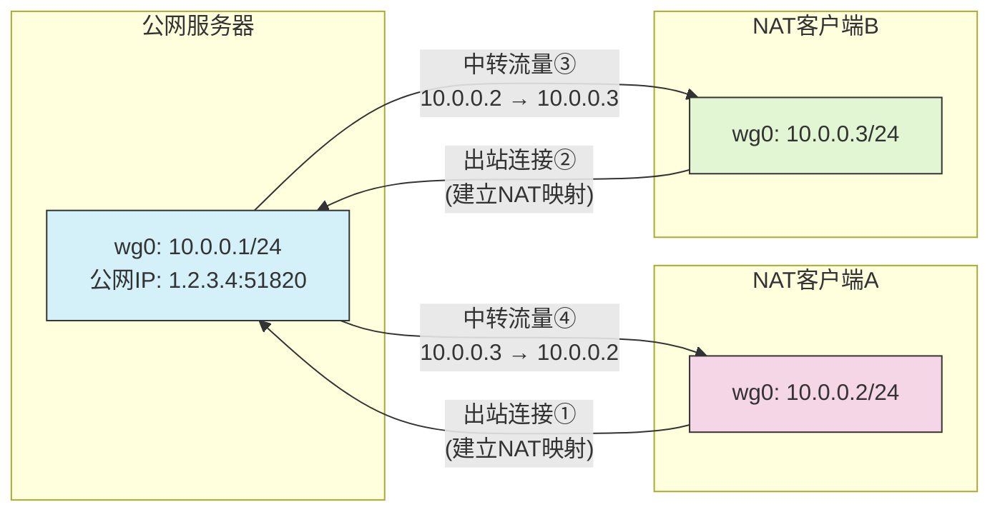

## 1.目标环境

### 1.1.终端

| 终端     | 操作系统     | 公网 ip |
| -------- | ------------ | ------- |
| 云服务器 | Ubuntu 24.04 | 1.2.3.4 |
| 客户端   | Windows 10   | /       |
| 客户端   | Windows 10   | /       |

### 1.2.软件

| 名称      | 相关链接                  |
| --------- | ------------------------- |
| WireGuard | https://www.wireguard.com |

## 2.配置过程

### 2.1.服务器端

**（1）安装并配置 WireGuard**

使用如下命令在 Ubuntu 中安装 WireGuard

```bash
sudo apt update && sudo apt install wireguard-tools
```

为了方便管理，我们在用户目录下创建一个 wireguard 文件夹，并切换到该文件夹，将其作为工作文件夹（如无特殊说明，之后的操作均在此目录中进行）

```bash
mkdir -p ~/wireguard
cd ~/wireguard
```

使用如下命令生成服务器端的公钥与私钥

```bash
wg genkey | tee server.key | wg pubkey > server.pubkey
```

接着创建一个名为 wg0.conf 的文件以作为 WireGuard 的配置文件。编辑创建的 wg0.conf，填入以下内容：

```ini
[Interface]
Address = 10.8.0.1/24
ListenPort = 51820
PrivateKey = [SERVER/private.key]
PostUp = iptables -A FORWARD -i %i -j ACCEPT;
PostUp = iptables -A FORWARD -o %i -j ACCEPT;
PostUp = iptables -t nat -A POSTROUTING -o eth0 -j MASQUERADE
PostDown = iptables -D FORWARD -i %i -j ACCEPT;
PostDown = iptables -D FORWARD -o %i -j ACCEPT;
PostDown = iptables -t nat -D POSTROUTING -o eth0 -j MASQUERADE
```

| 配置组      | 配置项       | 说明                                | 取值                                                                    |
| ----------- | ------------ | ----------------------------------- | ----------------------------------------------------------------------- |
| [Interface] | Address      | 服务器端的虚拟局域网 IP             | IP 格式：`X.X.X.X/子网前缀`，如服务器`10.8.0.1/24`                      |
| [Interface] | ListenPort   | 监听端口                            | 这里用 51820，你也可以选一个其他能用的，需要能通过防火墙（UDP）         |
| [Interface] | PrivateKey   | 服务器端的身份凭证私钥              | 填之前生成的 server_private.key 文件里的内容                            |
| [Interface] | PostUp ...   | 用于在运行时启用流量转发和 NAT 伪装 | 一般不需要额外调整<br> -o eth0 可能需要根据你的实际默认路由接口进行调整 |
| [Interface] | PostDown ... | 用于在关闭时取消流量转发和 NAT 伪装 | 一般不需要额外调整<br> -o eth0 可能需要根据你的实际默认路由接口进行调整 |

> 快速定位默认路由接口
>
> ```bash
> ip route show default | awk '{print $5}'
> ```

**（2）打开 IP 转发**

使用如下命令打开 IP 转发（临时）

```bash
sudo sysctl -w net.ipv4.ip_forward=1
```

若你要永久启用 IP 转发，使用如下命令

```bash
echo "net.ipv4.ip_forward=1" | sudo tee -a /etc/sysctl.conf
sudo sysctl -p
```

**（3）防火墙放行（UDP）**

取决于你的 ListenPort，这里用的是 51820，则需要在服务器放行端口 51820/udp

```bash
# 如果使用的是ufw
sudo ufw allow 51820/udp
```

> 注：云服务器的防火墙通常需要通过供应商提供的控制面板调整

### 2.2.客户端

#### 2.2.1.第一个客户端

**（1）安装并配置 WireGuard**
下载并安装 WireGuard Windows 版（https://www.wireguard.com/install）
打开软件，点击新建隧道 → 新建空隧道，会弹出如下面板，并自动生成的公钥和私钥

名称任填，配置文件输入框中填入以下内容

```ini
[Interface]
PrivateKey = [...]
Address = 10.8.0.2/24

[Peer]
PublicKey = [SERVER/public.key]
AllowedIPs = 10.8.0.0/24
Endpoint = 1.2.3.4:51820
PersistentKeepalive = 25
```

| 配置组      | 配置项              | 说明                                                                | 取值                                                                                                        |
| ----------- | ------------------- | ------------------------------------------------------------------- | ----------------------------------------------------------------------------------------------------------- |
| [Interface] | Address             | 当前客户端机使用的虚拟局域网 IP                                     | IP 格式：`X.X.X.X/子网前缀`，需在服务器允许的 IP 范围内（如服务器为`10.8.0.1/24`时客户端应为`10.8.0.X/24`） |
| [Interface] | PrivateKey          | 客户端的身份凭证私钥，用于加密通信和身份验证                        | 自动生成，不要改动                                                                                          |
| [Peer]      | PublicKey           | 目标端（服务器）的身份凭证公钥                                      | 之前在服务器上生成的 server_public.key 里的内容                                                             |
| [Peer]      | AllowedIPs          | 定义哪些目标 IP 的流量会通过隧道，使用逗号分隔                      | `10.8.0.0/24`表示：<br>- 发送到该网段的流量经加密隧道<br>- 接受来自该网段的隧道流量                         |
| [Peer]      | Endpoint            | 目标端（服务器）的公网接入点                                        | 服务器的公网 IP:ListenPort                                                                                  |
| [Peer]      | PersistentKeepalive | 配置心跳包的发送间隔（秒），用于 NAT 穿透时维持连接（仅客户端需要） | 单位为秒，一般 20-30 秒就行                                                                                 |

填好后如下图


**（2）放行防火墙**

使用管理员身份执行以下 powershell 命令

```powershell
New-NetFirewallRule `
    -DisplayName "允许 WireGuard 子网 ICMP (10.8.0.0/24)" `
    -Direction Inbound `
    -Protocol ICMPv4 `
    -IcmpType 8 `
    -RemoteAddress 10.8.0.0/24 `
    -Action Allow `
    -Enabled True
```

成功后输出如下

```powershell
Name                          : {0ae8e092-9c84-4645-ae12-b70a4985c7c9}
DisplayName                   : 允许 WireGuard 子网 ICMP (10.8.0.0/24)
Description                   :
DisplayGroup                  :
Group                         :
Enabled                       : True
Profile                       : Any
Platform                      : {}
Direction                     : Inbound
Action                        : Allow
EdgeTraversalPolicy           : Block
LooseSourceMapping            : False
LocalOnlyMapping              : False
Owner                         :
PrimaryStatus                 : OK
Status                        : 已从存储区成功分析规则。 (65536)
EnforcementStatus             : NotApplicable
PolicyStoreSource             : PersistentStore
PolicyStoreSourceType         : Local
RemoteDynamicKeywordAddresses : {}
PolicyAppId                   :
PackageFamilyName             :
```

#### 2.2.2.第二个客户端

操作基本同第一个客户端，只是需要修改一下 Address 的值（通常采用主机号递增即可），修改后的配置文件如下

```ini
[Interface]
PrivateKey = [...]
Address = 10.8.0.3/24

[Peer]
PublicKey = [SERVER/public.key]
AllowedIPs = 10.8.0.0/24
Endpoint = 1.2.3.4:51820
PersistentKeepalive = 25
```

同理，如果有第三、第四等更多客户端，在这一配置的基础上修改 Address 的值即可

### 3.连接

#### 3.1.服务器端（Ubuntu）

运行如下命令以链接

```bash
sudo wg-quick up ~/wireguard/wg0.conf
```

输入以下命令以允许客户端联机

```bash
sudo wg set wg0 peer [CLIENT/public.key] allowed-ips [CLIENT/lan.ip/32]
```

| 参数                | 说明                |
| ------------------- | ------------------- |
| [CLIENT/public.key] | 客户端公钥          |
| [CLIENT/lan.ip/32]  | 客户端虚拟局域网 ip |

例如对于如下客户端配置


应当运行

```bash
sudo wg set wg0 peer pwDp2H9N0eYUaBv8g3owOYk4zvGYBR+5JbMve7/teEY= allowed-ips 10.8.0.2/32
```

将所有需要连接的客户端都按如上操作添加

使用如下命令查看状态

```bash
sudo wg
```

成功的输出应该如下（此处有两个客户端接入）

```bash
interface: wg0
  public key: [SERVER/public.key]
  private key: (hidden)
  listening port: 51820

peer: [CLIENT/public.key]
  allowed ips: 10.8.0.2/32

peer: [CLIENT/public.key]
  allowed ips: 10.8.0.3/32
```

#### 3.2.客户端（Windows）

打开 WireGuard 主界面，点击“连接”即可


#### 3.3.连通测试

使用客户端（如 10.8.0.2） ping 服务器的虚拟局域网 ip（如 10.8.0.1）

```bash
ping 10.8.0.1
```

使用服务器（如 10.8.0.1） ping 客户端的虚拟局域网 ip（如 10.8.0.2）

```bash
ping 10.8.0.2
```

使用客户端（如 10.8.0.2） ping 其他客户端（如 10.8.0.3）的虚拟局域网 ip

```bash
ping 10.8.0.2
ping 10.8.0.3
```

若客户端与服务器之前，客户端之间都能 ping 通则表示连通成功，否则请对照先前步骤，检查是哪一步出现了问题（通常是防火墙配置问题，可考虑从暂时关闭防火墙开始进行排查）

## 4.备注

### 4.1.在服务器端添加 Peer

为了避免每次启动 WireGuard 都需要运行`sudo wg set wg0 peer [CLIENT/public.key] allowed-ips [CLIENT/lan.ip/32]`，可以按如下修改服务器端的 WireGuard 配置文件

```ini
[Interface]
Address = 10.8.0.1/24
ListenPort = 51820
PrivateKey = [SERVER/private.key]
PostUp = iptables -A FORWARD -i %i -j ACCEPT;
PostUp = iptables -A FORWARD -o %i -j ACCEPT;
PostUp = iptables -t nat -A POSTROUTING -o eth0 -j MASQUERADE
PostDown = iptables -D FORWARD -i %i -j ACCEPT;
PostDown = iptables -D FORWARD -o %i -j ACCEPT;
PostDown = iptables -t nat -D POSTROUTING -o eth0 -j MASQUERADE

[Peer]
PublicKey = [CLIENT1/public.key]
AllowedIPs = [CLIENT1/lan.ip]/32

[Peer]
PublicKey = [CLIENT2/public.key]
AllowedIPs = [CLIENT2/lan.ip]/32
```

| 参数                | 说明                  |
| ------------------- | --------------------- |
| [CLIENT/public.key] | 客户端的公钥          |
| [CLIENT/lan.ip]     | 客户端的虚拟局域网 ip |

### 4.2.开启/关闭连接

服务器端（Ubuntu）使用如下命令开启/关闭连接

```bash
sudo wg-quick up ~/wireguard/wg0.conf # 开启
sudo wg-quick down ~/wireguard/wg0.conf # 关闭
```

客户端（Windows）直接在 WireGuard 界面中点击“连接/断开”即可

### 4.3.拓扑图


