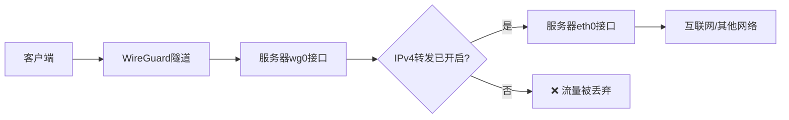

## 服务器端配置

### Linux

(1) 安装 WireGuard

```bash
sudo apt install wireguard
```

(2) 创建密钥对

```bash
wg genkey | tee server.key
wg pubkey < server.key | tee server.pubkey
```

(3) 创建配置文件

`wg0.conf`

```ini
[Interface]
Address = 10.8.0.1/24
ListenPort = 51820
PrivateKey = [SERVER/key]

PostUp = iptables -A FORWARD -i %i -j ACCEPT;
PostUp = iptables -A FORWARD -o %i -j ACCEPT;
PostUp = iptables -t nat -A POSTROUTING -o eth0 -j MASQUERADE

PostDown = iptables -D FORWARD -i %i -j ACCEPT;
PostDown = iptables -D FORWARD -o %i -j ACCEPT;
PostDown = iptables -t nat -D POSTROUTING -o eth0 -j MASQUERADE

[Peer]
PublicKey = [CLIENT/pubkey]
AllowedIPs = 10.8.0.2/32
```

注：iptables 的一系列操作用于在运行时启用/停用流量转发和 NAT 伪装。其中 `-o eth0` 可能需要根据实际默认路由接口进行调整，可使用 `ip route show default | awk '{print $5}'` 命令快速获取默认路由接口。

(4) 启用 IPv4 转发

```bash
sudo sysctl -w net.ipv4.ip_forward=1
```

查看当前 `net.ipv4.ip_forward` 的值

```bash
cat /proc/sys/net/ipv4/ip_forward
```



(5) 启动/关闭隧道

启动

```bash
sudo wg-quick up wg0
```

查看状态

```bash
sudo wg
```

关闭

```bash
sudo wg-quick down wg0
```

## 客户端配置

### Windows

(1) 下载 WireGuard 并安装

https://zh-wireguard.com/install/

(2) 创建配置

打开 WireGuard，点击`新建隧道`->`新建空隧道`，在配置输入框中填入并保存以下信息

```ini
[Interface]
PrivateKey = [AUTO_GENERATED]
Address = 10.8.0.2/24

[Peer]
PublicKey = [SERVER/pubkey]
AllowedIPs = 10.8.0.0/24
Endpoint = [SERVER/ip:port]
PersistentKeepalive = 25
```

(3) 连接/断开

选中隧道配置文件后点击 `连接`/`断开` 即可

### Linux

(1) 安装 WireGuard

```bash
sudo apt install wireguard
```

(2) 创建密钥对

```bash
wg genkey | tee client.key
wg pubkey < client.key | tee client.pubkey
```

(3) 创建配置文件

`client.conf`

```ini
[Interface]
PrivateKey = [CLIENT/key]
Address = 10.8.0.2/24

[Peer]
PublicKey = [SERVER/pubkey]
AllowedIPs = 10.8.0.0/24
Endpoint = [SERVER/ip:port]
PersistentKeepalive = 25
```

(4) 连接/断开

连接

```bash
sudo wg-quick up client
```

查看状态

```bash
sudo wg
```

断开

```
sudo wg-quick download client
```
