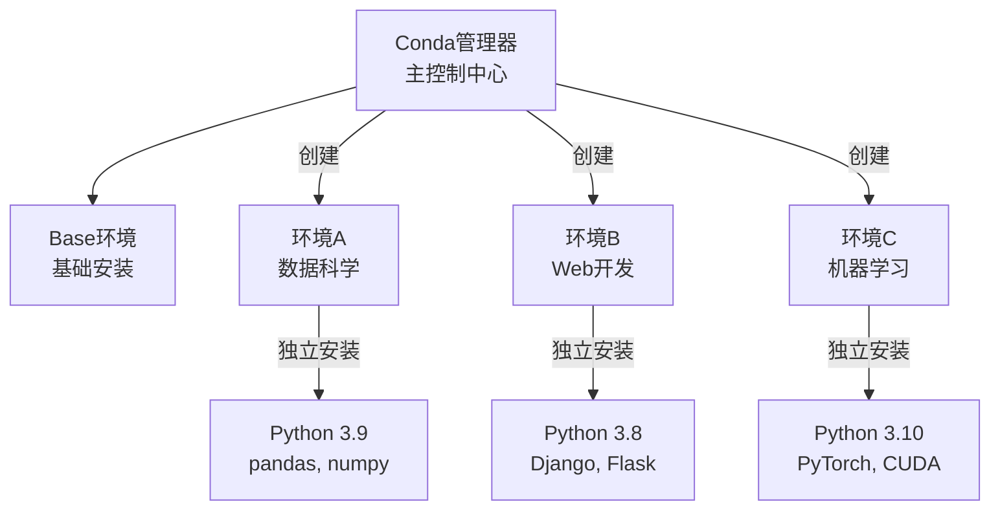

### 3.1 PyTorch 安装

#### 3.1.1 Python 介绍

Python 是一门通用高级编程语言，由 Guido van Rossum 于 1991 年首次发布，以简介、易读的语法和强大的功能而闻名。作为一门高级语言，Python 的代码设计贴近人类自然思维，并自动管理内存、硬件等底层细节，这使得开发者无需像使用 C 语言那样手动操作内存或深入硬件层面，能更专注业务逻辑。Python 的设计哲学强调代码的可读性与简洁性，尤其适合初学者入门，同时也能支撑起复杂项目的开发需求。

**主要特点**

-   **简单易学**：语法简洁，结构清晰，易于学习
-   **开源免费**：Python 及其大多数库以开源形式发布，可自由使用与学习
-   **跨平台**：支持 Windows、macOS、Linux 等多种操作系统，代码可轻松移植运行
-   **丰富的第三方库**：拥有庞大而活跃的生态系统，涵盖科学计算（如 NumPy）、数据分析（如 Pandas）、Web 框架（如 Diango）、图形界面（如 PyQt）等众多领域
-   **多范式**：支持面向对象、过程式、函数式等多种编程范式，适应不同的开发风格和项目需求
-   **动态类型**：变量类型在运行时确定，配合自动内存管理，具有极高的开发效率
-   **解释执行**：Python 是一门解释型语言，代码由解释器逐行读取并动态持续，无需预先编译为机器码[注 1]

> 注 1：实际上，对于现代 Python，这一论述与事实略有不符。现代 Python 出于性能等多方面因素考虑，在运行 Python 代码时，Python 代码会首先被编译为字节码，然后由 Python 虚拟机解释执行。在 Python 3.13 后甚至开始引入即时编译器（JIT）以提高性能。这一编译过程对程序员透明，无需程序员显式完成。

**主要应用领域**

-   **数据分析**：借助 Pandas、NumPy、Matplotlib 等工具进行数据清洗、处理与可视化，是数据科学家的首选语言之一
-   **机器学习与人工智能**: TensorFlow、PyTorch、Scikit-learn 等主流框架均以 Python 为核心
-   **网络爬虫**：借助 Requests、BeautifulSoup、Scrapy、Seleinum 等库，Python 可轻松编写爬虫代码，高效抓取和解析互联网信息。
-   **Web 开发**：借助 Django、Flash、FastAPI 等框架，可快速构建网站及后端服务
-   **自动化脚本**：借助 PyAutoGUI、Selenium 等库，可快速构建用于日常任务自动化的脚本

**Python 代码示例**

```python
# hello world
print("hello world")

# 变量
name = "Python"
print(name)

# 条件判断
x = 10
if x > 0:
    print("正数")
else:
    print("非正数")

# 循环
for i in range(5):
    print(i)

# 函数定义
def greet(user):
    return f"你好，{user}!"

print(greet("开发者"))

# 类定义
class Cat:
    def meow(self):
        print("meow")

Cat().meow()
```

#### 3.1.2 虚拟环境介绍

虚拟环境是 Python 中一个独立的运行环境，允许用户在同一台计算机上为不同的项目创建隔离的 Python 环境，每个环境都有自己独立的 Python 版本与包依赖，互不干扰。

**虚拟环境机制图示（以 Conda 为例）**



**为什么需要虚拟环境**

1. **避免项目依赖冲突**：例如项目 A 需要特定版本的 NumPy，而项目 B 需要和项目 A 不同版本的 NumPy
2. **减少系统环境污染**：避免全局包污染系统环境
3. **维持环境一致性**：确保开发、测试和生产环境的一致性

**常用的 Python 虚拟环境管理工具**

1. **venv**：Python 自带的虚拟环境管理工具，便于使用，但与系统 Python 版本强绑定
2. **anaconda/miniconda**：专注于科学计算与数据科学的虚拟环境管理工具，miniconda 可视为 anaconda 的轻量版
3. **uv**：使用 Rust 编写的新一代 Python 环境管理工具，适用于多种常规项目

#### 3.1.3 PyTorch 安装

**PyTorch 版本概述**

-   硬件平台

    -   **GPU 版**：使用 CPU 进行计算的版本，性能远低于 GPU（CUDA） 版，但只需 CPU 即可运行，适用于无 GPU（CUDA） 的环境
    -   **GPU （CUDA）版**：利用 NVIDIA GPU 的 CUDA 加速计算的版本，需要支持 CUDA 的硬件环境才可使用，性能通常显著优于 CPU 版

-   操作系统

    -   **Linux（推荐）**：Linux 是 PyTorch 主要支持的操作系统，能够最方便地安装 PyTorch；若宿主机没有安装 Linux 操作系统，而是使用 Windows 操作系统，也可使用 Windows 平台的 WSL2（Windows Subsystem for Linux 2），WSL2 支持直接使用 CUDA
    -   **Windows**：Windows 下也可安装 PyTorch，但相对 Linux 而言安装可能较为麻烦，且可能遇到更多问题
    -   **MacOS**：MacOS 无法安装 CUDA 版本的 PyTorch

-   安装方法

    -   **虚拟环境安装（推荐）**：在虚拟环境中安装 PyTorch 可以确保环境的稳定性，减少潜在的环境冲突风险，减少降低安装时因环境差异造成的各类未知错误
    -   **直接安装**：直接为本机 Python 安装 PyTorch，此安装方法极易引起环境冲突，通常不建议

**安装 PyTorch**

鉴于虚拟环境安装 PyTorch 的显著优势，此部分将介绍在 Conda 虚拟环境中安装 PyTorch 的方法。

> 若使用 Windows 系统，可考虑使用 WSL2

**(1) 安装 Miniconda**

-   Linux

在 Shell 中依次运行以下命令以安装最新版 Miniconda

```bash
wget https://repo.anaconda.com/miniconda/Miniconda3-latest-Linux-x86_64.sh
chmod +x ./Miniconda3-latest-Linux-x86_64.sh
./Miniconda3-latest-Linux-x86_64.sh -b -p $HOME/miniconda
```

执行以下命令激活 Conda 环境

```bash
source ~/miniconda/bin/activate
```

执行以下命令查看 Conda 版本，若输出版本号（如 conda 25.11.1）则表示 Conda 安装成功

```bash
conda --version
```

-   Windows

通过以下链接下载 Windows Miniconda x64 安装包，运行安装包并按指示安装 Miniconda

```
https://repo.anaconda.com/miniconda/Miniconda3-latest-Windows-x86_64.exe
```

安装时建议均选择默认选项，如无明确需求，请勿更改选项，避免出现未知错误。

安装完成后，打开系统开始菜单，运行 `Anaconda Prompt` 以打开激活了 Conda 环境的 Shell。同样地，在打开的 Shell 中执行以下命令检查 Conda 的安装

```bash
conda --version
```

**(2) 创建虚拟环境**

在 Shell 中运行以下命令以创建 Conda 虚拟环境

```bash
conda create -y -n pytorch_env python=3.13
```

该环境命名为 pytorch_env，使用 Python 3.13 作为虚拟环境所用的 Python。如对特定版本有要求，可以将 3.13 修改为其他 Python 版本号，如 python=3.12。

使用以下命令激活 pytorch_env 虚拟环境

```bash
conda activate pytorch_env
```

**(3) 安装 PyTorch**

-   **GPU（CUDA） 版**

要安装 CUDA 版 PyTorch，需要有支持 CUDA 的 GPU，并安装 CUDA 开发工具组件。通过以下链接进入 CUDA 开发工具组件 CUDA Toolkit 的下载页面，在页面中选择目标环境的操作系统与架构，根据网站提供的安装指示安装 CUDA Toolkit

```
https://developer.nvidia.com/cuda-downloads
```

在 CUDA Toolkit 安装完成后，在 Shell 中执行以下命令确认 CUDA 版本

```bash
nvidia-smi
```

输出的 CUDA Version 字段表示当前环境支持的最高版本 CUDA。

如果支持的 CUDA 版本在 12.8 及以上，在虚拟环境中执行如下命令以安装 PyTorch 12.8

```bash
pip install torch torchvision --index-url https://download.pytorch.org/whl/cu128
```

如果支持的 CUDA 版本在 12.8 以下，或需要安装特定版本的 PyTorch（如 PyTorch 12.6、PyTorch 13.0），可参考如下命令列表

```bash
# PyTorch 11.7
pip install torch torchvision --index-url https://download.pytorch.org/whl/cu117

# PyTorch 12.6
pip install torch torchvision --index-url https://download.pytorch.org/whl/cu126

# PyTorch 13.0
pip install torch torchvision --index-url https://download.pytorch.org/whl/cu130
```

> 注 1：也可以通过 Conda 安装，如通过 Conda 安装 PyTorch 12.1，可使用命令： conda install pytorch torchvision pytorch-cuda=12.1 -c pytorch -c nvidia

> 注 2：更低版本的 PyTorch 可能需要更低版本的 Python，若安装低版本的 PyTorch，请考虑使用 Python 3.12 及以下的版本。

-   **CPU 版**

如果没有 CUDA 可用，可直接使用如下命令安装 CPU 版 PyTorch

```bash
conda install torch torchvision --index-url https://download.pytorch.org/whl/cpu
```

**(4) 检查安装结果**

创建 `test-pytorch.py` 文件，写入以下用于检查 PyTorch 的代码

```python
import sys

print("Python版本:", sys.version)
print()

try:
    # 导入 PyTorch
    import torch
    print("PyTorch导入成功")
    print("PyTorch版本:", torch.__version__)

    # 检查CUDA是否可用
    print("CUDA是否可用:", torch.cuda.is_available())

    if torch.cuda.is_available():
        print("CUDA版本:", torch.version.cuda)
        print("当前设备:", torch.cuda.get_device_name(0))
        print("设备数量:", torch.cuda.device_count())
    else:
        print("CUDA不可用")
    print()

    # 测试简单的张量操作
    x = torch.tensor([1.0, 2.0, 3.0])
    y = torch.tensor([4.0, 5.0, 6.0])
    z = x + y
    print("简单张量计算测试成功:", z)

    # 测试GPU计算
    if torch.cuda.is_available():
        x_gpu = x.cuda()
        y_gpu = y.cuda()
        z_gpu = x_gpu + y_gpu
        print("GPU计算测试成功:", z_gpu.cpu())

except ImportError as e:
    print("错误: 无法导入PyTorch")
    print("请确保已正确安装PyTorch")
    print(f"错误信息: {e}")
except Exception as e:
    print(f"出现错误: {e}")
```

执行如下命令以运行该脚本

```bash
python test-pytorch.py
```

若 PyTorch 安装成功，应有类似如下的输出

```
Python版本: 3.13.11 | packaged by Anaconda, Inc. | (main, Dec 10 2025, 21:28:48) [GCC 14.3.0]

PyTorch导入成功！
PyTorch版本: 2.9.1+cu128
CUDA是否可用: True
CUDA版本: 12.8
当前设备: [此处显示你的 CUDA 设备]
设备数量: 1
cuDNN是否可用: True

简单张量计算测试成功: tensor([5., 7., 9.])
GPU计算测试成功: tensor([5., 7., 9.])
```

至此，带 PyTorch 的 Conda 虚拟环境搭建完成。
