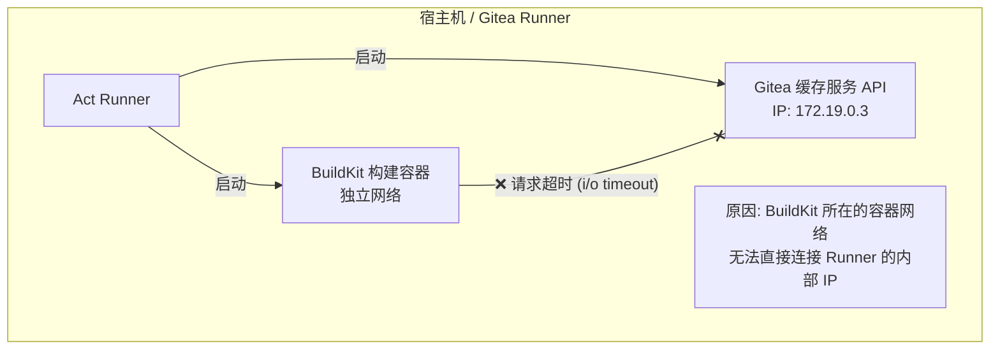
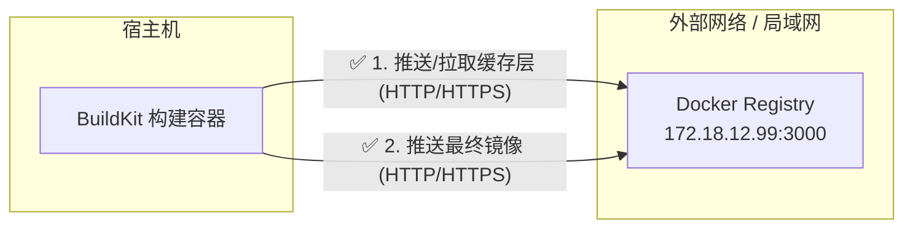

# Gitea 使用技巧

## 1. 通用 Action CI 工作流技巧

- 善用 Github/Gitea 的 `Environments` 与 `Secrets`

- 善用 workflows 的短路运算，如下面声明可实现定义了 `vars.DOCKER_REGISTRY` 时则使用其值，否则使用 `ghcr.io`

```yaml
env:
    REGISTRY: ${{ vars.DOCKER_REGISTRY || 'ghcr.io'}}
```

- 对于 `docker/setup-buildx-action`，可考虑使用环境变量 + 默认值的动态选取配置文件，如下

```yaml
- name: Set up Docker Buildx
  uses: docker/setup-buildx-action@v3
  with:
      buildkitd-config: ${{ env.BUILDKITD_CONFIG_FILE }}
```

- 避免使用专用 Action，如 `actions/delete-package-versions`

## 2. 镜像缓存错误

当负责构建的容器（BuildKit）和 Gitea 提供的缓存服务不在同一个频道（Docker 网络）上时，若在 `docker/build-push-action@v5` Action 中有如下配置：

```yaml
icache-from: type=gha
cache-to: type=gha,mode=max 
```

那么在构建时，可能遇到如下报错

```txt
ERROR: failed to build: failed to solve: DeadlineExceeded: Get "http://172.19.0.3:37833/_apis/artifactcache/cache?keys=buildkit-blob-1-sha256%3A098a7696206484c3661279565ff615cae9bf20173c9248162d3e20d5e0e96994&version=693bb7016429d80366022f036f84856888c9f13e00145f5f6f4dce303a38d6f2": dial tcp 172.19.0.3:37833: i/o timeout

::error::buildx failed with: ERROR: failed to build: failed to solve: DeadlineExceeded: Get "http://172.19.0.3:37833/_apis/artifactcache/cache?keys=buildkit-blob-1-sha256%253A098a7696206484c3661279565ff615cae9bf20173c9248162d3e20d5e0e96994&version=693bb7016429d80366022f036f84856888c9f13e00145f5f6f4dce303a38d6f2": dial tcp 172.19.0.3:37833: i/o timeout
```

**原因**：

此状网络状态如下：

缓存服务 (Artifact Cache)：Gitea Runner 启动了一个内部服务来模拟 GitHub Actions 的缓存 API，它的 IP 是 172.19.0.3（属于 Gitea Runner 创建的一个专用 Docker 网络）。

构建容器 (BuildKit)：当你运行 setup-buildx-action 时，它启动了一个全新、独立的 BuildKit 容器。这个容器默认连接到 Docker 的默认网桥，或者它自己的网络。

此时，错误发生：BuildKit 容器试图去连接 172.19.0.3:37833，但由于它不在 Gitea Runner 的那个专用网络里，它根本“看不见”这个 IP，或者被防火墙/路由规则拦截了，最终导致 i/o timeout。

**解决方案**：

❌️ 不要用 `type=gha`

```yaml
cache-from: type=gha
cache-to: type=gha,mode=max 
```

✅️ 用 `type=registry`

```yaml
cache-from: type=registry,ref=${{ env.FULL_IMAGE_NAME }}:buildcache-amd64
cache-to: type=registry,ref=${{ env.FULL_IMAGE_NAME }}:buildcache-amd64,mode=max
```

**附加说明**：

**type=gha(GitHub Actions Cache)**：

GitHub Actions 专用的缓存后端。GitHub Actions 的 Runner（运行器）在运行时，会启动一个 内部的 HTTP 缓存服务器（Artifact Cache Service）。

- 存储位置：GitHub 的专用对象存储（Azure Blob Storage 等），但在 Runner 看来，它是一个本地的 HTTP API。

- 通信方式：BuildKit 容器通过 HTTP 请求，向 Runner 暴露的这个内部 API 发送缓存数据。

- 认证：通过环境变量 ACTIONS_RUNTIME_TOKEN 和 ACTIONS_CACHE_URL 自动完成。



**type=registry(Container Registry Cache)**：



基于 Docker 镜像仓库的通用缓存后端。它把缓存层（Cache Layers）伪装成 Docker 镜像，存储在你的镜像仓库（Harbor, GHCR, Docker Hub）里。

- 存储位置：和你最终的 Docker 镜像在同一个地方。

- 通信方式：标准的 HTTPS 推送/拉取。只要你的机器能 docker push，它就能通过。

- 结构：它会把缓存元数据和图层打成一个包，推送到你指定的 tag（例如 :buildcache）。这实际上是一个“幽灵镜像”，它包含了构建过程中的中间层。

## 3. 为 Buildx 配置 network=host

在 `docker/setup-buildx-action` 中，可以将 buildx 的 network 模式配置为 `host`，这样可以让其直接通过 `127.0.0.1:3000` 访问宿主机的 Gitea 服务，避免很多麻烦。

```bash
uses: docker/setup-buildx-action@v3
with:
    driver-opts: network=host
```

这意味着在推送到本地 Gitea 时，本地仓库的地址可以硬编码为 `127.0.0.1:3000`，对于单机部署的维护比较友好。
