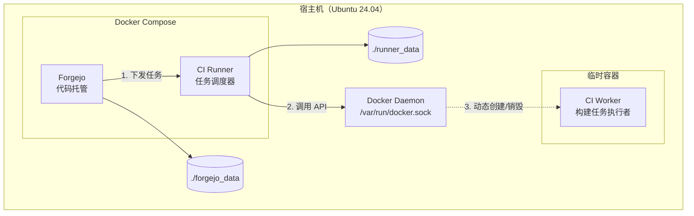
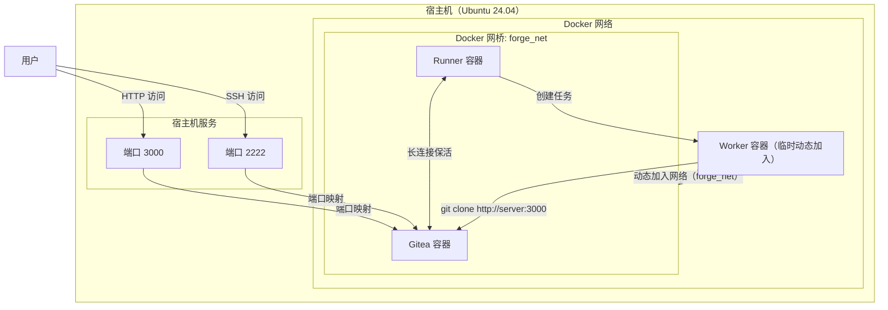

# Forgejo 部署指南（Docker）

## 1. 环境

| 环境类型 | 值                 |
| -------- | ------------------ |
| 操作系统 | Ubuntu 24.04       |
| CPU 架构 | x64                |
| 域名     | <https://git.home> |

---

## 2. 架构

### 2.1. 应用架构



### 2.2. 网络架构



---

## 3. 部署

### 3.1. 创建文件

文件结构总览

```txt
forgejo/
    Dockerfile
runner/
    Dockerfile
    command.sh
docker-compose.yml
```

**docker-compose.yml：**

```yml
name: forgejo

services:
    # 1. 代码托管平台主体
    server:
        image: codeberg.org/forgejo/forgejo:14
        container_name: forgejo-server
        restart: always
        environment:
            - USER_UID=${PUID:-1000}
            - USER_GID=${PGID:-1000}
            - TZ=${TIMEZONE:-Asia/Shanghai}
        networks:
            - forgejo_net
        volumes:
            - ${DATA_DIR:-.}/forgejo_data:/data
        ports:
            # Web 界面端口
            - "3000:3000"
            # Git SSH 端口
            - "2222:22"

    # 2. CI 执行器
    runner:
        image: code.forgejo.org/forgejo/runner:12
        container_name: forgejo-runner
        restart: always
        user: root
        depends_on:
            - server
        networks:
            - forgejo_net
        environment:
            - TZ=${TIMEZONE:-Asia/Shanghai}
            - FORGEJO_INSTANCE_URL=http://server:3000
            - FORGEJO_RUNNER_REGISTRATION_TOKEN=
            - DOCKER_HOST=unix:///var/run/docker.sock
        volumes:
            - ${DATA_DIR:-.}/runner_data:/data
            - /var/run/docker.sock:/var/run/docker.sock
        command: /bin/command.sh

networks:
    forgejo_net:
        name: forgejo_net
        external: false
```

配置说明

1. 为 Runner 挂载宿主机 `docker.sock` 是为了让 Runner 能调用宿主机的 Docker 来构建镜像。
2. Runner 容器默认以非 root 用户运行，没有权限调用挂载的 `docker.sock`，因此如果不以 rootless 模式部署，就需要指定其以 root 用户运行。
3. FORGEJO_RUNNER_REGISTRATION_TOKEN 需要先启动 server，从 Forgejo 的后台获取 Runner Token 后填入，填入后还需重启 runner。

**forgejo/Dockerfile：**

```dockerfile
FROM codeberg.org/forgejo/forgejo:14
```

> 作为中间层，提高灵活性，另外也能让 `docker ps` 看着好看点。

**runner/Dockerfile：**

```dockerfile
FROM code.forgejo.org/forgejo/runner:12

COPY ./command.sh /bin/command.sh

USER root
RUN chmod +x /bin/command.sh

USER 1000
```

> 其实这里确实可以不切回默认用户，但是尽量还是保持和原镜像的一致性。

**runner/command.sh：**

```bash
#!/bin/bash
set -e

if [ -z "$FORGEJO_RUNNER_REGISTRATION_TOKEN" ]; then
    echo 'Waiting for Token...';
    sleep 10;
    exit 1;
fi;

if [ ! -f /data/.runner ]; then
    echo 'First time setup: Registering runner...';
    forgejo-runner register \
        --no-interactive \
        --instance "$FORGEJO_INSTANCE_URL" \
        --token "$FORGEJO_RUNNER_REGISTRATION_TOKEN" \
        --name home-runner \
        --config /data/config.yml;
fi;

echo 'Starting runner daemon...';
exec forgejo-runner daemon --config /data/config.yml;
```

### 3.2. 准备配置

执行以下命令创建备挂载的目录

```bash
mkdir forgejo_data
mkdir runner_data
```

> 不要让 docker 自动创建，否则目录权限默认归属 root 用户

- Forgejo 配置

在 Forgejo 启动时配置即可，后续也可通过编辑宿主机被挂载的 `./forgejo/gitea/conf/app.ini` 文件进行配置。

- Runner 配置

执行以下命令生成 `Runner` 的配置文件模板 `runner_data/config.yaml`

```bash
docker run --rm code.forgejo.org/forgejo/runner:12 forgejo-runner generate-config > ./runner_data/config.yml
```

打开 `config.yml`，修改如下对应的字段：

```yaml
container:
    network: "forgejo_net"
    docker_host: "automount"

runner:
    labels:
        - "ubuntu-latest:docker://ghcr.io/catthehacker/ubuntu:act-22.04"
        - "ubuntu-22.04:docker://ghcr.io/catthehacker/ubuntu:act-22.04"
```

### 3.3. 启动与配置 Forgejo

执行以下命令启动容器编排

```bash
docker compose up --build
```

启动完成后打开 [http://localhost:3000](http://localhost:3000)，进入 Gitea 初始配置页面，按需调整配置，并注册管理员账户。

需要注意以下配置项

| 配置项       | 影响 app.ini 配置字段 | 值                       | 示例                 | 说明                                                                                                                             |
| ------------ | --------------------- | ------------------------ | -------------------- | -------------------------------------------------------------------------------------------------------------------------------- |
| 基础 URL     | ROOT_URL              | 宿主机域名或IP，带端口   | 192.168.100.101:3000 | 决定 HTTP 克隆地址、Runner 回调地址及 Docker 镜像库认证跳转地址。**必须**是 Runner 容器和宿主机 Docker Daemon 均可访问的网络地址 |
| 服务器域名   | DOMAIN，SSH_DOMAIN    | 宿主机域名或IP，不带端口 | 192.168.100.101      | 仅用于生成网页上显示的 SSH 克隆链接（如 git@...）。如果不设为宿主机地址，SSH 克隆地址可能会指向错误的 localhost                  |
| SSH 服务端口 | SSH_PORT              | Docker 中的端口映射值    | 2222                 | 用于生成 SSH 克隆链接中的端口号。**必须**与 docker-compose 中映射到宿主机的端口保持一致                                          |

> ROOT_URL 严禁使用 localhost 或 127.0.0.1，否则 Runner 可能会连接到它们自己内部。应该统一使用域名或局域网 IP。

### 3.4. 配置 ACT Runner

打开 `设置` -> `工作流` -> `运行器`，点击 `创建新运行器`，复制 `Registration Token`，将该 Token 填入到 `docker-compose.yml` 的 `FORGEJO_RUNNER_REGISTRATION_TOKEN`，如下

```yml
runner:
    environment:
        - FORGEJO_RUNNER_REGISTRATION_TOKEN=$你的Token
```

配置完成后运行以下命令重启 Runner

```bash
docker restart forgejo-runner
```

### 3.5. 预拉取 Action

预拉取是为了让 Gitea Action 直接使用本地镜像，从而显著提高 CI 效率。

使用**迁移外部仓库**功能，将以下 Action 仓库作为**镜像仓库**导入。

| 组织名  | 仓库名称            | URL                                             |
| ------- | ------------------- | ----------------------------------------------- |
| actions | checkout            | <https://github.com/actions/checkout>           |
| docker  | metadata-action     | <https://github.com/docker/metadata-action>     |
| docker  | login-action        | <https://github.com/docker/login-action>        |
| docker  | build-push-action   | <https://github.com/docker/build-push-action>   |
| docker  | setup-buildx-action | <https://github.com/docker/setup-buildx-action> |

> 仓库的 BASE URL 也可以换成 <https://code.forgejo.org/>，但没有必要

Runner 默认从 <https://data.forgejo.org> 拉取 Action，为了让 Runner 从本地部署的 Forgejo 中拉取 Action，需要编辑 `./forgejo/gitea/conf/app.ini`，添加以下配置：

```ini
[actions]
DEFAULT_ACTIONS_URL=self
```

---

## 4. CI 测试

基于 [sample](https://github.com/hiromuraki/sample_git) 创建一个简单的 CI 测试项目，这个项目中用到了一些仓库变量和密钥，因此在实际推送前需要先配置两者，才能保证 CI 顺利完成。

### 4.1. 配置变量

`设置` -> `工作流` -> `变量`

| 变量            | 值                   |
| --------------- | -------------------- |
| DOCKER_REGISTRY | 192.168.100.101:3000 |

> 此处的值填宿主机局域网 IP 是因为 runner 里使用的是宿主机的 Docker，容器内部网络的 DNS 解析对宿主机 Docker 其无效。

### 4.2. 配置密钥

（1）创建令牌

`设置` -> `应用`

令牌名称：ci-worker

权限需求如下：

| 权限       | 选项 |
| ---------- | ---- |
| repository | 读写 |

> 创建后立刻复制生成的密钥，密钥仅显示这一词，此后将不可查看。

（2）将令牌添加为密钥

`设置` -> `工作流` -> `密钥`

| 变量           | 值          |
| -------------- | ----------- |
| REGISTRY_TOKEN | $生成的密钥 |

### 4.3. 触发 CI

在 Forgejo 创建一个空仓库，并将 `sample` 代码推送到 Forgejo 后即可触发 CI，等待 CI 完成即可。

---

## 5. 参考资料

1. [Forgejo - Codeberg.org](https://codeberg.org/forgejo)
1. [Forgejo Administrator Guide | Forgejo – Beyond coding. We forge.](https://forgejo.org/docs/next/admin/)
1. [Forgejo及其Action自部署简明教程 | LiuShen's Blog](https://blog.liushen.fun/posts/de5fc13c/)
