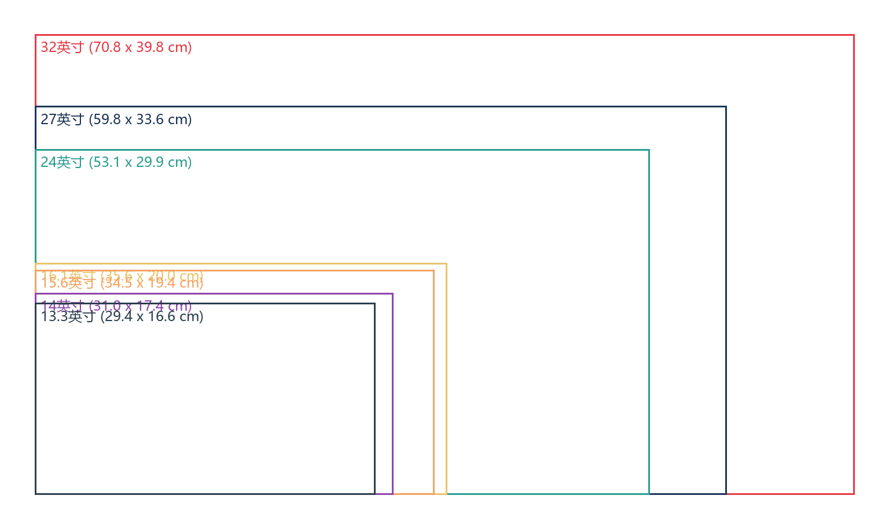

# 显示屏选购指南

## 1. 色域

显示器能显示的色彩范围，影响画面颜色的准确度，常见色域如下

| 色域标准               | 覆盖范围说明                                                          | 常见应用与备注                                                                                               |
| ---------------------- | --------------------------------------------------------------------- | ------------------------------------------------------------------------------------------------------------ |
| **sRGB**               | 国际标准色域，由微软和惠普制定，广泛用于网络、办公、Windows 系统。    | 是当前最通用、兼容性最好的色彩标准。                                                                         |
| sRGB ≈ 65% - 75%       | 覆盖约 65%-75%的 sRGB 色彩空间。                                      | 入门级显示器，普通家用、办公基本够用，但色彩表现力一般。                                                     |
| sRGB ≈ 99% - 100%      | 完全或近乎完全覆盖 sRGB 色彩空间。                                    | 主流及专业入门显示器，能准确还原网络图片、视频和大部分设计内容的色彩，是图像处理的基础要求。                 |
| **Adobe RGB**          | 专业印刷与摄影色域，由 Adobe 制定，覆盖更广，特别是青绿色区域。       | 主要用于专业摄影、印刷出版、高级艺术创作等领域。                                                             |
| Adobe RGB ≈ 99% - 100% | 完全或近乎完全覆盖 Adobe RGB 色彩空间。                               | 专业级显示器，价格较高。需要配合支持色彩管理的软件（如 Photoshop）才能发挥优势，否则可能色彩过饱和。         |
| **DCI-P3**             | 数字影院色域，色彩范围介于 sRGB 和 Adobe RGB 之间，红色和绿色更鲜艳。 | 广泛应用于电影后期、高质量视频制作、HDR 内容、苹果生态系统（Mac, iPhone, iPad）和高端消费电子产品。          |
| DCI-P3 ≈ 90% - 95%     | 覆盖 90%-95%的 DCI-P3 色彩空间。                                      | 中高端消费级显示器，能提供比 sRGB 更生动、沉浸的视觉体验，适合影音娱乐和部分内容创作。                       |
| DCI-P3 ≈ 98% - 100%    | 完全或近乎完全覆盖 DCI-P3 色彩空间。                                  | 高端专业/创作型显示器，用于视频调色、影视后期、游戏开发等对广色域有严格要求的领域。                          |
| **NTSC**               | 电视广播色彩标准，历史较久，现多用作色域范围的对比参考。              | 目前显示器领域已较少作为主推标准，通常用于换算对比。NTSC 72% ≈ 99-100% sRGB；NTSC 45% ≈ 60-70% sRGB。        |
| NTSC 45%               | 覆盖约 45%的 NTSC 色彩空间（约 60-70% sRGB）。                        | 非常入门的显示器或笔记本屏幕，色彩表现较弱。                                                                 |
| NTSC 72%               | 覆盖约 72%的 NTSC 色彩空间（约 99-100% sRGB）。                       | 可视为基本达到 100% sRGB 覆盖，是主流显示器的水平。                                                          |
| **Rec. 709**           | 高清电视国际标准，其色域范围与 sRGB 基本相同\*\*。                    | 主要用于广播电视和视频制作领域。显示器标注 Rec. 709 100%覆盖，通常意味着其 sRGB 模式校准准确，适合视频剪辑。 |

## 2. 分辨率

- 2K（2560 x 1440）：通常建议
- 1080P（1920 x 1080）：当 Switch 输出屏用
- 4K（3840 x 2160）：可能更好，但更贵

## 3. 屏幕尺寸

**常见屏幕尺寸对比：**

## 4. 亮度

室内使用通常不需要额外考虑，如果需要带出们，建议 300nit 起步。

## 5. 面板

**OLED：**

OLED（有机发光二极管），由阳极、阴极和夹在两极之间的有机功能层组成，当电流通过时，电子和空穴分别从阴极和阳极注入到有机功能层，它们在有机功能层中相遇并复合，释放出能量，激发有机分子发光。

OLED 技术最大的特点是自发光，每个像素都可以独立控制开关和发光强度，无需背光源。

这种自发光特性让 OLED 屏幕能够实现真正的黑色，呈现出极致的对比度和深邃的黑色表现。同时，OLED 还具有广视角、高响应速度、低功耗等优点。

**QLED：**

QLED，即量子点发光二极管，其技术核心是量子点。量子点是一种纳米级别的半导体材料，具有独特的光学性质，当量子点受到电场或光激发时，会发出特定波长的光，光的颜色由量子点的尺寸决定。

QLED 显示屏采用蓝色 LED 作为背光源，通过量子点膜将蓝光转换为红光和绿光，再与蓝光混合形成白光，最后通过液晶面板实现图像显示。

此外，QLED 技术通过量子点的精确控制，实现了更广的色域覆盖和更高的色彩饱和度，能够呈现出更加逼真、鲜艳的画面。

**ISP：**

TODO
